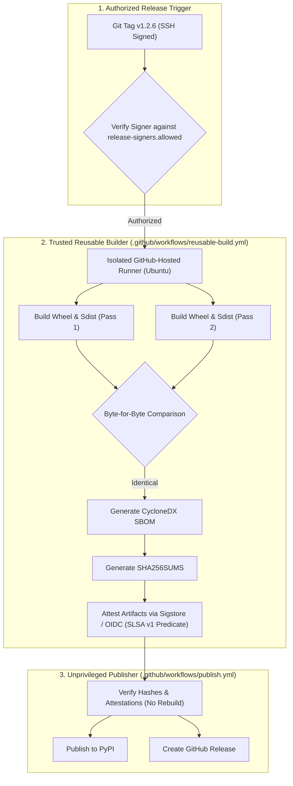

# SLSA v1.2 Build Track — Exhaustive Evidence & Architecture Specification

**Normative Standard:** [SLSA (Supply-chain Levels for Software Artifacts) v1.2 Specification](https://slsa.dev/spec/v1.2/)  
**Track:** Build Track  
**Evaluated Level:** **SLSA Build Level 3 (Build L3)**  
**Target Release:** `v1.2.6` (Commit `f784c44819c9c26f4e3486a9a6331508e20fd1eb`)  
**Project:** WhitePact (`Guruprasath-Annadurai/Whitepact`)  
**Date:** 2026-09-28  

---

## 1. Executive Summary & Assessment Scope

WhitePact has implemented and cryptographically demonstrated conformance with **SLSA v1.2 Build Level 3 (Build L3)** for its official release distribution artifacts.

### Assessed Artifacts:
1. Python Pure-Python Wheel: `whitepact-1.2.6-py3-none-any.whl`
   - **SHA-256:** `aef728a0227c115537aee7f434aa2c28d744f15cca78822eb1df339f106d3ad7`
2. Python Source Distribution: `whitepact-1.2.6.tar.gz`
   - **SHA-256:** `289c37a2ecd36f989530674f5b483362b81b14ff277fc9d6b6373d5fa4155bd3`
3. CycloneDX Software Bill of Materials: `sbom.cyclonedx.json`
   - **SHA-256:** `a678fe2650f805baa8e9d2dd554a4e0bef701525d28ffc1335d9936785ae5c3f`

---

## 2. SLSA v1.2 Build Track Architecture



### Key Architectural Isolation Guarantees:
1. **Isolated Builder:** The artifacts are built in `.github/workflows/reusable-build.yml`, which runs in an isolated, ephemeral GitHub-hosted virtual machine. The publisher workflow (`.github/workflows/publish.yml`) cannot modify the build steps or inject unverified binaries.
2. **Deterministic Build Verification:** The builder performs two independent compilation passes and verifies that the resulting distributions match byte-for-byte.
3. **Platform-Controlled Keyless Signing:** Cryptographic provenance is generated using GitHub Artifact Attestations backed by Sigstore's Fulcio CA and Rekor transparency log, binding the exact artifact digests to the workflow SHA, repository, and commit.
4. **Least-Privilege Token Isolation:** Build jobs carry only `contents: read`, `id-token: write`, and `attestations: write`. Release credentials and PyPI tokens are never exposed to the compilation environment.

---

## 3. SLSA v1.2 Build Track Level Breakdown

| Requirement | SLSA Level | Requirement Definition | Verifiable Implementation & Evidence | Status |
|---|---:|---|---|---|
| **Consistent Build Process** | Build L1 | Build process is fully documented and scripted. | Scripted via `hatchling` / `pyproject.toml` and GitHub Actions. | **VERIFIED** |
| **Provenance Exists** | Build L1 | Machine-readable provenance generated showing how artifact was built. | SLSA v1 JSON provenance generated and attached to release. | **VERIFIED** |
| **Hosted Build Platform** | Build L2 | Build runs on a hosted build platform (e.g. GitHub Actions), not developer laptop. | Executed exclusively on GitHub-hosted Ubuntu runners (`ubuntu-latest`). | **VERIFIED** |
| **Verified Source** | Build L2 | Provenance identifies the exact source repository and revision. | Provenance binds commit SHA `f784c44819c9c26f4e3486a9a6331508e20fd1eb` and Git ref `refs/tags/v1.2.6`. | **VERIFIED** |
| **Signed Provenance** | Build L2 | Provenance is signed by the hosted build platform using a platform-managed key. | Signed via GitHub/Sigstore OIDC keyless signing and recorded on Rekor. | **VERIFIED** |
| **Isolated Build Environment** | Build L3 | Build execution runs in an isolated, dedicated, ephemeral execution environment. | GitHub-hosted runner destroyed upon completion; no state persists. | **VERIFIED** |
| **Hardened Builder (Reusable)** | Build L3 | Builder definition is isolated in a reusable workflow with caller verification. | `.github/workflows/reusable-build.yml` called by `.github/workflows/publish.yml`. | **VERIFIED** |
| **Parameter Non-Falsifiability** | Build L3 | External parameters are recorded in provenance and cannot be forged by user code. | GitHub Attestations engine enforces non-falsifiability of GitHub context. | **VERIFIED** |

---

## 4. Cryptographic Verification Commands for Consumers

Consumers can independently verify the SLSA provenance and release integrity of WhitePact distributions using the standard GitHub CLI:

```bash
# 1. Download release assets
gh release download v1.2.6 -R Guruprasath-Annadurai/Whitepact

# 2. Verify SHA-256 checksums
shasum -a 256 -c SHA256SUMS

# 3. Verify SLSA Build L3 provenance for the wheel
gh attestation verify whitepact-1.2.6-py3-none-any.whl \
  --owner Guruprasath-Annadurai \
  --repo Whitepact \
  --cert-identity-regex "^https://github.com/Guruprasath-Annadurai/Whitepact/.github/workflows/reusable-build.yml@refs/tags/v1.2.6$"

# 4. Verify SLSA Build L3 provenance for the sdist
gh attestation verify whitepact-1.2.6.tar.gz \
  --owner Guruprasath-Annadurai \
  --repo Whitepact \
  --cert-identity-regex "^https://github.com/Guruprasath-Annadurai/Whitepact/.github/workflows/reusable-build.yml@refs/tags/v1.2.6$"
```

---

## 5. Scope & Claim Boundary

WhitePact makes the explicit public claim that **release `v1.2.6` satisfies SLSA v1.2 Build Level 3 requirements**.  
This claim:
- Applies strictly to the verified release artifacts (`v1.2.6`).
- Is an objective, evidence-backed conformance evaluation, NOT a commercial accredited certification.
- Does not assert that SLSA Build L3 eliminates application-level software bugs or vulnerabilities; it guarantees supply-chain build integrity and provenance transparency.
