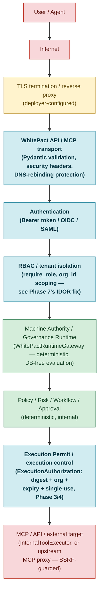
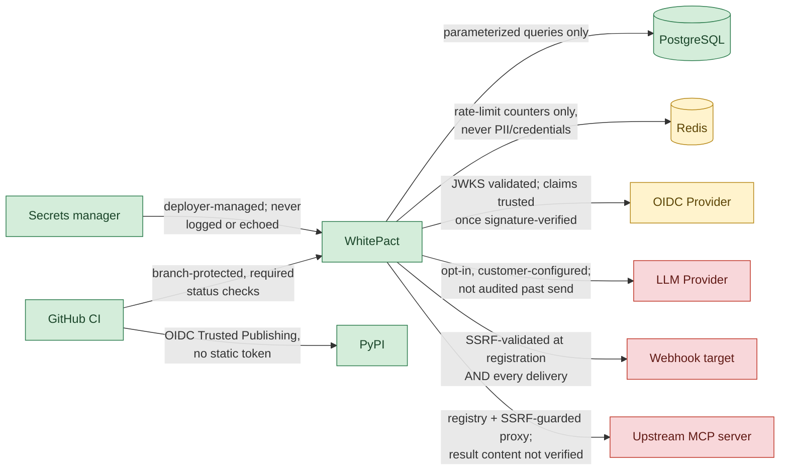

# Trust Boundary Diagram

**Directive**: WHITEPACT — FULL ENTERPRISE PRODUCTION + PUBLIC LAUNCH
CLOSURE MASTER DIRECTIVE, Phases 32/33. `00_MASTER_READINESS_AUDIT.md`
named this as low-priority — "the properties are already true in code,
just not diagrammed."

**Found already substantially true, not just in code but in
documentation too**: `SECURITY_ASSURANCE_CASE.md` §3 ("Trust
Boundaries") already contains a real, thorough ASCII diagram of the
primary request path plus a table of every secondary boundary
(Postgres, Redis, OIDC provider, LLM provider, webhook targets,
upstream MCP servers, CI/CD, secrets manager) — that document remains
the authoritative source, cross-referencing each boundary to the exact
code enforcing it. This page adds a rendered diagram for readers who
want the visual form, and does not restate the authoritative prose —
see [`SECURITY_ASSURANCE_CASE.md` §3](../../SECURITY_ASSURANCE_CASE.md#3-trust-boundaries)
for the full boundary-by-boundary validation detail.

## Primary request path

## Secondary boundaries (not on the primary request path)

## Legend

- **Red (untrusted)**: no assumption of good behavior; every input
  from this side is validated (SSRF checks, request schema validation)
  or explicitly out of this platform's control (an LLM provider's own
  handling of a sent request).
- **Yellow (conditionally trusted)**: trusted for a specific, narrow
  purpose only — Redis holds rate-limit counters, never governance
  data; an OIDC provider is trusted for token signing, not for
  arbitrary claim content beyond what's cryptographically verified.
- **Blue (boundary — validates and forwards)**: where this platform's
  own code actively checks something before letting a request proceed
  further in. Every one of the four blue nodes on the primary path
  corresponds to a specific closure-phase's own work this session:
  authentication (Phase 6's `AuthFailureLimiter`), RBAC/tenant
  isolation (Phase 7's cross-org IDOR fix), the execution permit
  (Phases 3/4's structural binding + replay protection).
- **Green (trusted, internal)**: deterministic, DB-free, no external
  input crosses in at this layer — `DETERMINISTIC_VS_PROBABILISTIC.md`
  is the fuller argument for why this is a meaningful trust
  distinction, not just an internal/external label.
