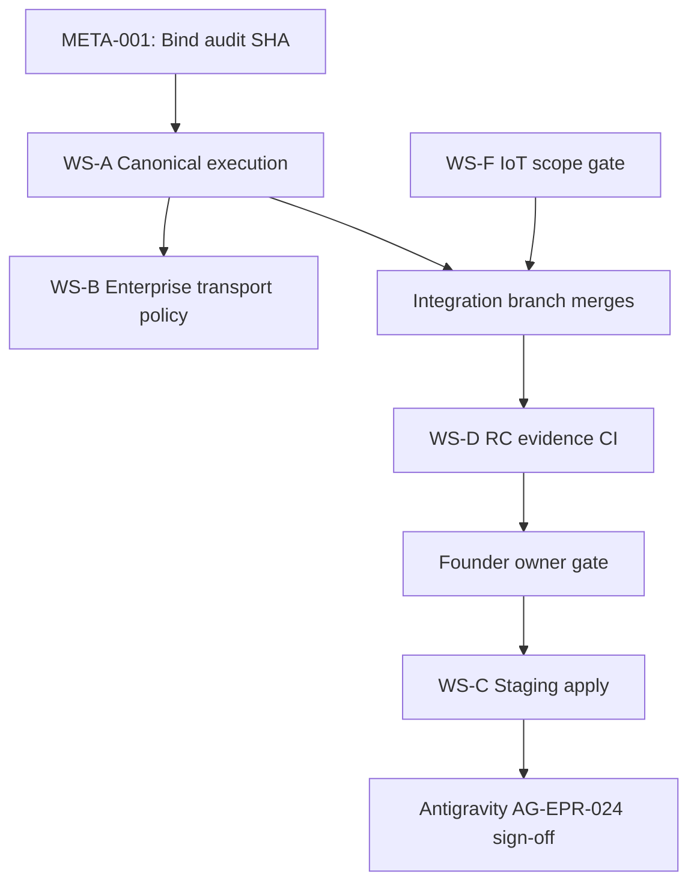

# Phase 1 — Implementation proposal (founder approval required)

**Status:** PROPOSED — **do not execute** until founder approves this document and Antigravity validates reconciled findings (META-001 + register).

**Objective:** One **fully integrated**, **verifiably secure** enterprise product at a **single qualified SHA**—not parallel modules that pass isolated tests.

**Out of scope for Phase 1 (explicit):** mass rewrite, legacy deletion without dependency graph, PyPI **2.0.0** or new public version announcement, unqualified branch merges, paid infra provisioning, enabling unrestricted stdio execution, declaring findings closed without reproduction.

---

## 1. Integration strategy (single RC)

### 1.1 Target integration branch

Create **`cursor/whitepact-v1-enterprise-integrated-rc-f7a9`** from **`origin/main` @ `81beb3a`**, then merge **in order** (each step must pass full CI before the next):

| Step | Source | Rationale |
|------|--------|-----------|
| 1 | `cursor/whitepact-v1-rc-blocker-fixes-01` (#108) | PG/migration/mypy blockers for RC |
| 2 | `cursor/whitepact-v1-combined-rc-f7a9` (#107) | Paddle + combined RC closure |
| 3 | `cursor/whitepact-enterprise-cloud-v1-f7a9` (#128) | Cloud control plane + infra modules |
| 4 | Cherry-pick only **qualified** fixes from assurance branches (#109, #110) as needed | Avoid wholesale merge of draft PRs |

**Founder decision point:** confirm this ordering or substitute a different qualified stack before Step 1.

### 1.2 Published vs repo truth

- Keep **1.3.1** (or patch bump only if required for integration fixes)—**no 2.0.0**.
- Record final SHA in `release-evidence/<sha>/` using existing campaign layout.

### 1.3 Codex boundary

- **Codex:** corporate website, public marketing, Paddle portal UI closure branches as agreed—**no** changes to `src/responsibleai/governance/*` or cloud control plane without Cursor integration review.

---

## 2. Workstreams (Cursor backlog)

### WS-A — Canonical execution closure (P0)

**Findings:** AG-EPR-001, AG-EPR-002, AG-EPR-006, AG-EPR-008  

**Work:**

1. Wire `sovereignty_kernel.evaluate()` (or approved subset) into `apply_governance`, `apply_upstream_governance`, and `resume_approval` with **fail-closed** defaults on resolver errors.
2. Persist approval **authority / epoch / policy** snapshots at request time; resume must re-resolve against snapshots.
3. Remove or gate **synthetic** `AuthorityContext` construction on hosted and upstream paths.

**Acceptance:**

- New tests in `tests/test_phase1_*` and `tests/test_mcp_governance_dispatch.py` proving deny on stale/mismatched bindings.
- Antigravity replay of historical P0 scenarios on integrated RC SHA.
- No regression: existing 60-test hosted governance slice green.

**Fail-closed checks:** DB unavailable → refuse dispatch; resolver exception → refuse; missing epoch → refuse.

### WS-B — Enterprise transport policy (P0)

**Findings:** AG-EPR-004  

**Work:**

1. Introduce **deployment profile** (`WHITEPACT_DEPLOYMENT_PROFILE=community|enterprise`) documented in operator guide.
2. **Community:** stdio unchanged (still unrestricted by product promise).
3. **Enterprise:** stdio either disabled or requires local governance bootstrap token; hosted paths mandatory for managed tenants.

**Acceptance:**

- Contract tests: enterprise profile cannot dispatch without governance initialization.
- Explicit **no** change to default community behavior without profile set.

**Explicit non-goal:** Do **not** enable “unrestricted stdio execution” in enterprise hosted or cloud cells.

### WS-C — WhitePact Cloud merge + staging qualification (P0)

**Findings:** AG-EPR-015–021  

**Work:**

1. Complete WS-A integration **before** staging apply (grants must not authorize across broken canonical layer).
2. After founder signs `OWNER_APPROVAL_GATE.md`, execute staging sequence in `docs/whitepact-cloud/staging/ANTIGRAVITY_INDEPENDENT_REVIEW_HANDOFF.md`.
3. Wire `IdentityRevocationPort` to real APIs; enable executor only in staging with scoped grants.

**Acceptance:**

- Live matrix: N-*, I-*, A-*, O-* witnesses recorded by Antigravity.
- Offboarding AG-EPR-018 moves from **MITIGATED local** to **VERIFIED live**.

### WS-D — Integrated RC evidence (P0)

**Findings:** AG-EPR-007, AG-EPR-024  

**Work:**

1. One green GitHub Actions run on integrated branch HEAD (full `ci.yml`: static + test jobs).
2. `release-evidence/<sha>/final/pytest-full.log`, supply-chain scans, provenance.
3. Update `PHASE0_MASTER_DEFECT_REGISTER.md` verification column only with Antigravity sign-off.

**Acceptance:**

- Founder + Antigravity agree SHA is **the** enterprise RC candidate.

### WS-E — Release hygiene (P1)

**Findings:** AG-EPR-009, AG-EPR-010, AG-EPR-011, AG-EPR-012  

**Work:** Browser matrix, staging perf template, Paddle E2E on integrated RC.

**Acceptance:** Documented in existing enterprise master report format; no production deploy claim.

### WS-F — IoT / Device Bridge (P0 scope gate)

**Finding:** AG-EPR-014  

**Work (founder choice):**

- **Option F1:** Descope from v1 enterprise RC with signed ADR (fastest to integrated product).
- **Option F2:** Greenfield minimal device grant binding reusing `ExecutionAuthorization` patterns (longer).

**Acceptance:** Either ADR in `docs/architecture/` or first end-to-end device test path.

---

## 3. Sequencing (technical dependencies)

---

## 4. Phase 1 exit criteria (for Antigravity)

| # | Criterion |
|---|-----------|
| 1 | Audit SHA reconciled or superseded by founder-written baseline amendment |
| 2 | Integrated RC SHA recorded; CI green; evidence folder complete |
| 3 | All **P0** rows in master register **CLOSED** or **accepted risk** with founder sign-off |
| 4 | Cloud staging live tests complete OR explicitly deferred with written scope cut |
| 5 | No claim of “Production Ready” — target **Stage 2 — Qualified Staging** at most |
| 6 | Codex website changes isolated; no governance regressions from website merges |

---

## 5. Risks and mitigations

| Risk | Mitigation |
|------|------------|
| Merging PRs reopens fixed bugs | Ordered merge + full CI each step; no “merge everything” |
| Canonical wiring breaks Community | Profile-gated behavior; default remains community |
| Staging cost | Stay within documented BOM; no new paid tiers without approval |
| Doc drift (RELEASE_SECURITY_GATE) | Update gate doc in same PR as WS-A closure |

---

## 6. Founder approval checklist

- [ ] Accept integrated RC merge order (§1.1) or amend
- [ ] Accept IoT Option F1 vs F2
- [ ] Accept staging apply after WS-A (recommended)
- [ ] Authorize Cursor to begin **WS-A** only after Antigravity acknowledges register

**Upon approval:** Cursor opens integration branch, implements WS-A first, pushes after each logical commit, updates PR, and requests Antigravity re-validation.
