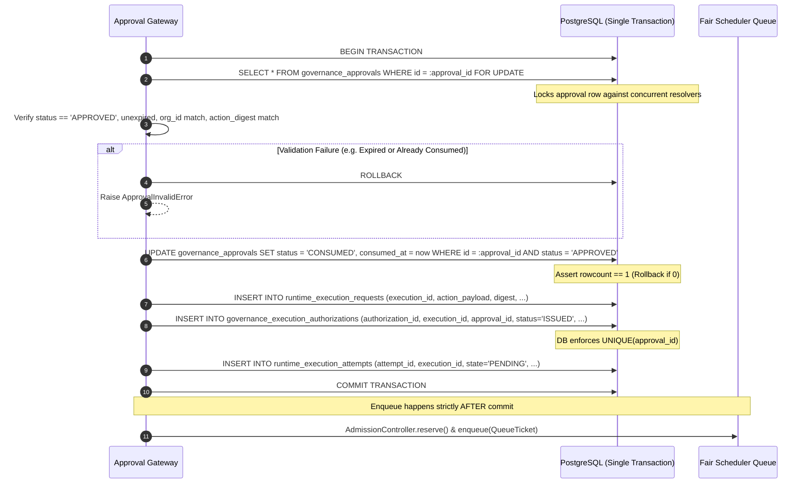

# WhitePact Phase 7A: Approval Consumption & Authorization Issuance Atomicity

**Document Status:** CANONICAL SPECIFICATION PASS 4 (SECURITY REMEDIATION)
**Target Runtime Base SHA:** `13e8de034f8b31bd7cae4f47398f71b24c923c3c` (`ENTERPRISE_AUTH_CANONICAL_SHA` — APPROVED)
**Reconciled Core Ancestor SHA:** `12810825c407960ca2aa9ada94fbae056db37290`
**Related Migrations:** `0049_runtime_execution_requests.py`, `0050_runtime_execution_authorizations.py`

---

## 1. Problem Statement & Threat Model

When an action requires human approval (`REQUIRE_APPROVAL`), the execution permit must only be minted upon verified approval consumption:
1. **Split-Brain Approval Consumption:** If approval consumption and execution authorization issuance occur in separate database transactions:
   - Approval is marked `CONSUMED`, but database disconnects before authorization is committed: the human approval is lost and cannot be used, causing client failure.
   - Or, authorization is inserted, but approval consumption fails: the same approval can be used again to mint a second authorization, violating single-use governance.
2. **Duplicate Minting Race:** If two approval-resolution requests arrive concurrently for the same `approval_id`, both could pass validation and mint duplicate execution authorizations.

Phase 7A eliminates this window by combining approval consumption, execution request creation, and authorization issuance into **one atomic PostgreSQL transaction**.

---

## 2. Database Constraint: `UNIQUE(approval_id)`

In `governance_execution_authorizations` (Migration `0050`), the `approval_id` column is defined with an explicit unique constraint:

```sql
ALTER TABLE governance_execution_authorizations
ADD CONSTRAINT uq_exec_auth_approval_id UNIQUE (approval_id);
```

### Invariants Enforced by Database:
- **At Most One Authorization Per Approval:** PostgreSQL rejects any attempt to insert a second authorization referencing the same `approval_id` with an `IntegrityError` (violates unique constraint).
- **Direct ALLOW Paths:** For operations that do not require human approval, `approval_id` is `NULL`. In standard SQL, multiple rows may have `approval_id = NULL` without violating the unique constraint.

---

## 3. Atomic Transaction Control Flow: `consume_approval_and_issue_execution`

The centralized service `ApprovalExecutionService.consume_and_issue(...)` executes the following single-transaction sequence:



---

## 4. Exact Rollback & Failure Behavior

1. **Concurrent Resolution Race:** If two workers attempt to resolve the same approval simultaneously:
   - Worker 1 acquires the `FOR UPDATE` lock on `governance_approvals`.
   - Worker 2 blocks on the row lock.
   - Worker 1 marks status `CONSUMED`, commits the transaction, and releases the lock.
   - Worker 2 acquires the lock, inspects `status`, observes `status == 'CONSUMED'`, rolls back, and raises `ApprovalAlreadyConsumedError`.
2. **Database Failure Mid-Transaction:** If PostgreSQL disconnects during the request or authorization insert:
   - Transaction automatically rolls back.
   - `governance_approvals.status` reverts to `APPROVED`.
   - No row is written to `runtime_execution_requests` or `governance_execution_authorizations`.
   - Zero `QueueTicket` objects are emitted to Redis or in-memory queues.
3. **Queue Emission Boundary:** The enqueuing of the `QueueTicket` occurs strictly outside and after the successful transaction commit. An enqueued ticket is therefore mathematically guaranteed to reference durably committed PostgreSQL rows.
