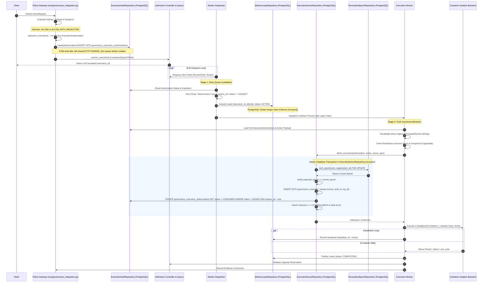

# WhitePact Phase 7A: Canonical Worker Execution Flow

**Document Status:** CANONICAL SPECIFICATION PASS 2 (ATOMIC AUTHORITY INTEGRATION CORRECTION)
**Target Runtime Base SHA:** `13e8de034f8b31bd7cae4f47398f71b24c923c3c` (`ENTERPRISE_AUTH_CANONICAL_SHA` — APPROVED)
**Reconciled Core Ancestor SHA:** `12810825c407960ca2aa9ada94fbae056db37290`
**Current Migration Head:** `0048` (`migrations/versions/0048_enforce_paddle_binding_atomicity.py`)

---

## 1. Overview and Control Chain Invariants

This document specifies the authoritative, end-to-end execution control chain for Phase 7A.

### Core Architectural Invariants:
1. **Durable Issuance Precedes Queueing:** No `QueueTicket` may be generated until the `ExecutionAuthorization` is durably committed to PostgreSQL (`governance_execution_authorizations`).
2. **Zero Execution Without Canonical Admission:** No worker may execute a container or invoke a tool without successfully completing `admit_execution()` in `src/responsibleai/governance/execution.py`.
3. **Combined Atomic Admission Transaction:** `ExecutionNonceRepository.consume()` in `src/responsibleai/db/execution_nonce_repository.py` executes a single database transaction combining the epoch lock, nonce insertion, and conditional authorization status update (`ISSUED -> CONSUMED` with `rowcount == 1`).
4. **Queue Isolation:** Queue tickets (`QueueTicket`) contain strictly non-privileged pointers (`execution_id`, `authorization_id`, `org_id`, `principal_id`, `action_digest`).
5. **Database-Enforced Lease Exclusivity:** A worker must acquire an exclusive `ACTIVE` lease row in `runtime_worker_leases` before invoking `admit_execution()`.
6. **No Exactly-Once Network Promise:** If a remote network side-effect is interrupted, its outcome is marked `UNCERTAIN` and requires reconciliation or proof of idempotency; blind replay is forbidden.

---

## 2. End-to-End Control Sequence Diagram

---

## 3. Step-by-Step State Transitions and Failure Exits

### Step 1: Policy Gateway Decision & Durable Issuance
- **Actor:** `src/responsibleai/mcp/governance_integration.py` (`execute_governed_action` and `resolve_approval_and_execute`).
- **Action:** Evaluates policies; if decision is `ALLOW` or `ALLOW_WITH_REDACTION`, calls `authorize_execution()`.
- **Durable Issuance Gate:** Immediately invokes `ExecutionAuthorizationRepository.create(authorization)`.
- **Failure Exit:** If DB insert fails:
  - Exception is caught and logged.
  - NO `QueueTicket` is generated.
  - NO reservation is acquired.
  - Client receives HTTP 500/503. Zero unpersisted authority is issued.

### Step 2: Admission Reservation & Queueing
- **Action:** `AdmissionController.reserve_execution()` checks semaphores.
- **Enqueuing:** A lightweight `QueueTicket` is enqueued to `FairExecutionScheduler`.
  - Contents: `execution_id`, `authorization_id`, `organization_id`, `principal_id`, `action_digest`, `enqueued_at`.
- **Response:** Client receives HTTP 202 with `execution_id`.

### Step 3: Dequeue & Early Invalidation (Stage 1)
- **Actor:** Worker Dispatcher.
- **Action:** Dequeues next `QueueTicket` in round-robin tenant fairness.
- **Early Invalidation Checks:**
  1. `now < authorization.expires_at` (derived expiration).
  2. `authorization.status == ISSUED`.
  3. `organization_id` active in `OrgRepository` (not suspended, deleted, or tombstoned).
- **Failure Exit:** If any check fails, ticket is discarded / sent to dead-letter. **No worker lease is acquired, no nonce is burned.**

### Step 4: Exclusive Worker Lease Acquisition
- **Actor:** Worker Dispatcher.
- **Action:** Inserts a lease record in `runtime_worker_leases` (`status = ACTIVE`).
- **Enforcement:** PostgreSQL partial unique index `idx_runtime_worker_leases_active_execution` on `(execution_id) WHERE status = ACTIVE`.
- **Failure Exit:** If another worker already holds an `ACTIVE` lease, `IntegrityError` is raised and the loser aborts cleanly.

### Step 5: Worker Pre-Flight Binding Revalidation
- **Actor:** Execution Worker.
- **Action:**
  1. Verifies `compute_action_digest(action) == authorization.action_digest`.
  2. Verifies principal identity matches `authorization.principal_id`.
  3. Verifies session validity via `SessionService` (if session-bound).
  4. If BreakGlass: queries `iam_break_glass_sessions` to verify session is `ACTIVE` and unexpired.
  5. If target requires drift verification: invokes `check_target_fingerprint()`.
- **Failure Exit:** On mismatch, transitions lease to `FAILED`, releases capacity, and exits.

### Step 6: Final Canonical Admission (`admit_execution`)
- **Actor:** Execution Worker invoking `src/responsibleai/governance/execution.py:admit_execution()`.
- **Transaction Owner:** `ExecutionNonceRepository.consume()` in `src/responsibleai/db/execution_nonce_repository.py`.
- **Atomic Sequence (Single Connection, Single Transaction):**
  1. `lock_epoch(conn, organization_id)` (`SELECT ... FOR UPDATE`).
  2. Verify `current_epoch == expected_epoch`. (Mismatch raises `StaleRevocationEpochError`).
  3. `INSERT INTO governance_execution_nonces (nonce, authorization_id, organization_id, consumed_at)`. (Duplicate raises `NonceAlreadyConsumedError`).
  4. `UPDATE governance_execution_authorizations SET status = CONSUMED, consumed_at = :now, updated_at = :now WHERE authorization_id = :id AND organization_id = :org_id AND status = ISSUED AND expires_at > :now`.
  5. Assert `rowcount == 1`. If `rowcount == 0`, raises `AuthorizationAlreadyConsumedError`.
  6. Commit transaction.
- **Failure Exit:** If any check fails, the transaction rolls back completely. Nonce is NOT inserted, authorization is NOT consumed.

### Step 7: Isolated Container Execution
- **Actor:** `ContainerIsolationBackend`.
- **Action:** Ephemeral container launched with `--network=none`, `--memory=256m`, `--cpus=0.5`, `--pids-limit=32`, timeout 15.0s.
- **Heartbeat:** Periodically updates `runtime_worker_leases.heartbeat_at`.

### Step 8: Evidence Recording & Lease Finalization
- **Actor:** Execution Worker.
- **Action:**
  1. Records outcome in `governance_evidence` and `governance_outcomes`.
  2. Updates `runtime_worker_leases` to `COMPLETED` (`completed_at = now()`).
  3. Calls `AdmissionController.release_execution()`.
