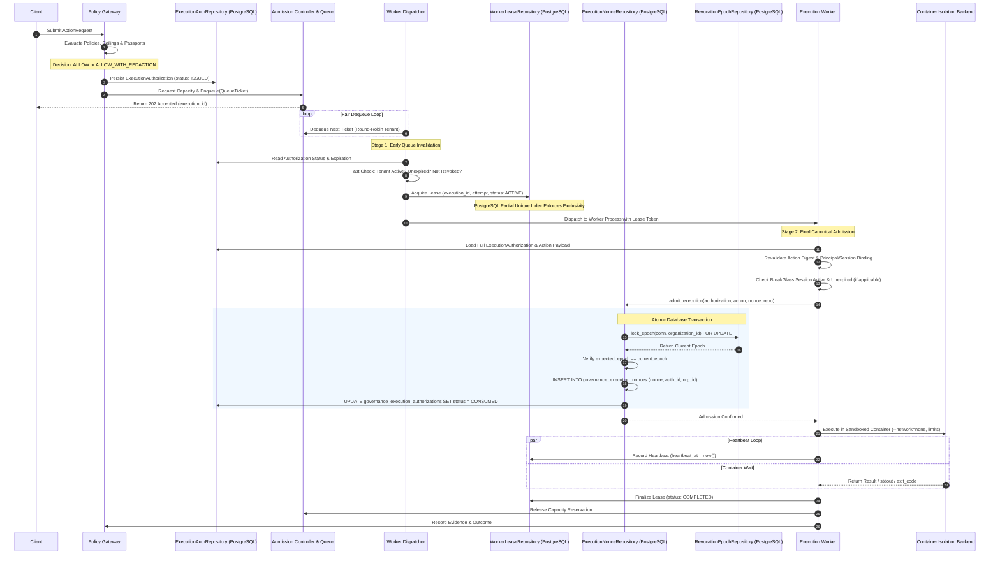

# WhitePact Phase 7A: Canonical Worker Execution Flow

**Document Status:** CANONICAL SPECIFICATION PASS 2 (POST-CODEX REVIEW REMEDIATION)
**Target Runtime Base SHA:** `13e8de034f8b31bd7cae4f47398f71b24c923c3c` (`ENTERPRISE_AUTH_CANONICAL_SHA` — APPROVED)
**Reconciled Core Ancestor SHA:** `12810825c407960ca2aa9ada94fbae056db37290`
**Current Migration Head:** `0048` (`migrations/versions/0048_enforce_paddle_binding_atomicity.py`)

---

## 1. Overview and Control Chain Invariants

This document resolves Codex review finding **P0-2** by specifying the authoritative, end-to-end execution control chain for Phase 7A.

### Core Architectural Invariants:
1. **Zero Execution Without Canonical Admission:** No worker may execute a container, call a local tool, or make an external MCP/HTTP call without successfully completing `admit_execution()` in `src/responsibleai/governance/execution.py`.
2. **Durable Authority Storage:** The `ExecutionAuthorization` is persisted in PostgreSQL (`governance_execution_authorizations`) at decision time. Workers load authority from the database, never from untrusted queue payloads.
3. **Queue Isolation:** Queue tickets (`QueueTicket`) contain strictly non-privileged pointers (`execution_id`, `authorization_id`, `org_id`, `principal_id`, `action_digest`). They contain zero reusable security credentials.
4. **Database-Enforced Lease Exclusivity:** A worker must acquire an exclusive `ACTIVE` lease row in `runtime_worker_leases` before invoking `admit_execution()`.
5. **No Exactly-Once Network Promise:** If a remote network side-effect is interrupted, its outcome is marked `UNCERTAIN` and requires human reconciliation or proof of idempotency; blind replay is forbidden.

---

## 2. End-to-End Control Sequence Diagram

---

## 3. Step-by-Step State Transitions and Failure Exits

### Step 1: Policy Gateway Decision & Issuance
- **Input:** `ActionRequest` from client or MCP integration.
- **Action:** Gateway evaluates organization policies, autonomy ceilings, and trust passports.
- **Decision:** Must be `ALLOW` or `ALLOW_WITH_REDACTION`. (If `REQUIRE_APPROVAL`, routed to `ApprovalRepository`; if `DENY`/`QUARANTINE`, rejected).
- **Durability Action:** Gateway invokes `ExecutionAuthorizationRepository.create()`, writing:
  - `authorization_id` (UUIDv4)
  - `organization_id`
  - `principal_id`
  - `action_digest` (`compute_action_digest(action)`)
  - `target_fingerprint` (optional Execution Permit v2 hash)
  - `decision`
  - `revocation_epoch` (read from `governance_revocation_epochs`)
  - `nonce` (UUIDv4 hex)
  - `issued_at`, `expires_at`
  - `status = ISSUED`
- **Failure Exit:** If DB write fails, request fails immediately with HTTP 500/503. Zero unpersisted authority is issued.

### Step 2: Admission Reservation & Queueing
- **Action:** `AdmissionController.reserve_execution()` checks local and distributed semaphores.
- **Enqueuing:** A lightweight `QueueTicket` is placed into `FairExecutionScheduler`.
  - Contents: `execution_id`, `authorization_id`, `organization_id`, `principal_id`, `action_ref`, `enqueued_at`.
- **Client Response:** Returns HTTP 202 with `execution_id`.

### Step 3: Dequeue & Early Invalidation (Stage 1)
- **Actor:** Worker Dispatcher.
- **Action:** Dequeues next `QueueTicket` using plan-neutral round-robin fairness.
- **Validation Checks:**
  1. Does `authorization_id` exist in PostgreSQL?
  2. Is `status == ISSUED`?
  3. Is `now < expires_at`?
  4. Is `organization_id` active in `OrgRepository` (not suspended, deleted, or tombstoned)?
- **Failure Exit:** If any check fails, the ticket is dropped or marked dead-letter. **No worker lease is acquired, no nonce is burned.**

### Step 4: Exclusive Worker Lease Acquisition
- **Actor:** Worker Dispatcher.
- **Action:** Inserts a lease record in `runtime_worker_leases`:
  - `lease_id` (UUIDv4)
  - `execution_id`
  - `authorization_id`
  - `organization_id`
  - `worker_id`
  - `attempt = 1` (or incremented attempt)
  - `status = ACTIVE`
  - `issued_at = now()`, `expires_at = now() + lease_ttl`, `heartbeat_at = now()`
- **Enforcement:** PostgreSQL partial unique index `idx_runtime_worker_leases_active_execution` on `(execution_id) WHERE status = ACTIVE`.
- **Failure Exit:** If another worker already holds an `ACTIVE` lease, `IntegrityError` is raised. The losing worker aborts cleanly.

### Step 5: Worker Pre-Flight Binding Revalidation
- **Actor:** Execution Worker.
- **Action:** Worker retrieves the `ExecutionAuthorization` and action arguments from durable storage:
  1. Computes `compute_action_digest(action)` from arguments and verifies match against `authorization.action_digest`.
  2. Verifies principal identity matches `authorization.principal_id`.
  3. Verifies session validity via `SessionService` (if session-bound).
  4. If execution required emergency BreakGlass: queries `iam_break_glass_sessions` to verify session is `ACTIVE` and unexpired.
  5. If target requires drift verification: invokes `check_target_fingerprint()` against current target.
- **Failure Exit:** On mismatch, transitions worker lease to `FAILED`, releases capacity, and terminates.

### Step 6: Final Canonical Admission (`admit_execution`)
- **Actor:** Execution Worker invoking `responsibleai.governance.execution.admit_execution()`.
- **Sequence:**
  1. Calls in-memory `_validate_authorization(authorization, action)`.
  2. Invokes `nonce_repo.consume(nonce, authorization_id, organization_id, expected_epoch)`:
     - Begins PostgreSQL transaction.
     - Calls `lock_epoch(conn, organization_id)` (`SELECT ... FOR UPDATE`).
     - Verifies `current_epoch == expected_epoch`. If mismatch, raises `StaleRevocationEpochError`.
     - Inserts `(nonce, authorization_id, organization_id, consumed_at)` into `governance_execution_nonces`. If duplicate, raises `NonceAlreadyConsumedError`.
     - Updates `governance_execution_authorizations SET status = CONSUMED, consumed_at = now() WHERE authorization_id = :id AND status = ISSUED`.
     - Commits PostgreSQL transaction.
  3. Calls post-await `_validate_authorization(authorization, action)`.
  4. Sets in-memory `authorization.consumed = True`.
- **Failure Exit:** If epoch is stale or nonce was already consumed, transaction rolls back. Worker raises `ExecutionNotAuthorizedError`, transitions lease to `FAILED`, and exits.

### Step 7: Isolated Container Execution
- **Actor:** `ContainerIsolationBackend`.
- **Action:** Launches ephemeral container:
  - Mandatory flags: `--network=none`, `--memory=256m`, `--cpus=0.5`, `--pids-limit=32`.
  - Wall-clock timeout: 15.0 seconds.
- **Heartbeat:** Background task updates `runtime_worker_leases.heartbeat_at` periodically while container runs.
- **Failure Exit:** On timeout or container crash, container is killed (`docker rm -f`), resources reclaimed.

### Step 8: Evidence Recording & Lease Finalization
- **Actor:** Execution Worker.
- **Action:**
  1. Records execution outcome in `governance_evidence` and `governance_outcomes`.
  2. Updates `runtime_worker_leases`:
     - `status = COMPLETED` (or `FAILED`)
     - `completed_at = now()`
  3. Invokes `AdmissionController.release_execution()` to return capacity slot to pool.
  4. Notifies client / webhook manager.
