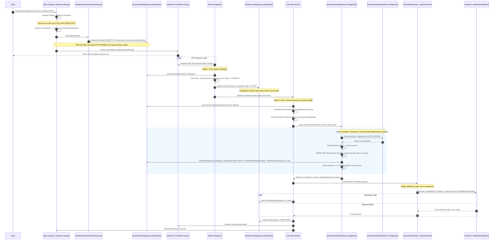

# WhitePact Phase 7A: Canonical Worker Execution Flow

**Document Status:** CANONICAL SPECIFICATION PASS 3 (FINAL CALL-PATH & SINGLE-ADMISSION CLOSURE)
**Target Runtime Base SHA:** `13e8de034f8b31bd7cae4f47398f71b24c923c3c` (`ENTERPRISE_AUTH_CANONICAL_SHA` — APPROVED)
**Reconciled Core Ancestor SHA:** `12810825c407960ca2aa9ada94fbae056db37290`
**Current Migration Head:** `0048` (`migrations/versions/0048_enforce_paddle_binding_atomicity.py`)

---

## 1. Overview and Control Chain Invariants

This document specifies the authoritative, end-to-end execution control chain for Phase 7A.

### Core Architectural Invariants:
1. **Durable Issuance Precedes Queueing:** No `QueueTicket` may be generated until the `ExecutionAuthorization` is durably committed to PostgreSQL (`governance_execution_authorizations`) via `DurableExecutionAuthorizationIssuer.issue()`. Applies to all internal tools and upstream MCP dispatch.
2. **Single Canonical Admission Gate:** No worker may execute a container or invoke a network tool without successfully completing `admit_execution()` in `src/responsibleai/governance/execution.py`.
3. **Worker-Owned Admission with Typed `AdmittedExecution`:** The worker exclusively calls `admit_execution()`, obtaining an immutable `AdmittedExecution` token. Downstream executors (`InternalToolExecutor` and `UpstreamServer`) consume this token and MUST NOT call `admit_execution()` again, eliminating double admission.
4. **Combined Atomic Admission Transaction:** `ExecutionNonceRepository.consume()` in `src/responsibleai/db/execution_nonce_repository.py` executes a single database transaction combining the epoch lock, nonce insertion, and conditional authorization status update (`ISSUED -> CONSUMED` with `rowcount == 1`).
5. **Queue Isolation:** Queue tickets (`QueueTicket`) contain strictly non-privileged pointers (`execution_id`, `authorization_id`, `org_id`, `principal_id`, `action_digest`). Zero credentials in Redis.
6. **Database-Enforced Lease Exclusivity:** A worker must acquire an exclusive `ACTIVE` lease row in `runtime_worker_leases` before invoking `admit_execution()`.
7. **No Exactly-Once Network Promise:** If a remote network side-effect is interrupted, its outcome is marked `UNCERTAIN` and requires reconciliation or proof of idempotency; blind replay is forbidden.

---

## 2. End-to-End Control Sequence Diagram

---

## 3. Step-by-Step State Transitions and Failure Exits

### Step 1: Decision & Centralized Durable Issuance
- **Actors:**
  - `src/responsibleai/mcp/governance_integration.py` (`execute_governed_action`, `resolve_approval_and_execute`)
  - `src/responsibleai/mcp/upstream_dispatch.py` (`dispatch_upstream_action`)
- **Action:** Evaluates policies; if decision is `ALLOW` or `ALLOW_WITH_REDACTION`, calls `authorize_execution()`.
- **Durable Issuance Gate:** Immediately invokes `DurableExecutionAuthorizationIssuer.issue(authorization)`.
- **Failure Exit:** If DB insert fails:
  - Exception is caught and logged.
  - NO `QueueTicket` is generated.
  - NO reservation is acquired.
  - Client receives HTTP 500/503. Zero unpersisted authority is issued.

### Step 2: Admission Reservation & Queueing
- **Action:** `AdmissionController.reserve_execution()` checks semaphores.
- **Enqueuing:** A lightweight `QueueTicket` is enqueued to `FairExecutionScheduler`.
  - Contents: `execution_id`, `authorization_id`, `organization_id`, `principal_id`, `action_digest`, `enqueued_at`.
- **Response:** Client receives HTTP 202 with `execution_id`.

### Step 3: Dequeue & Early Invalidation (Stage 1)
- **Actor:** Worker Dispatcher.
- **Action:** Dequeues next `QueueTicket` in round-robin tenant fairness.
- **Early Invalidation Checks:**
  1. `now < authorization.expires_at` (derived expiration).
  2. `authorization.status == ISSUED`.
  3. `organization_id` active in `OrgRepository` (not suspended, deleted, or tombstoned).
- **Failure Exit:** If any check fails, ticket is discarded / sent to dead-letter. **No worker lease is acquired, no nonce is burned.**

### Step 4: Worker Lease Acquisition & Stage 2 Revalidation
- **Actor:** Worker Process.
- **Action:** Acquires exclusive lease in `runtime_worker_leases` (`status = 'ACTIVE'`).
- **Pre-Flight Checks:**
  1. `action_digest == compute_action_digest(action)`.
  2. Principal exists and is not disabled.
  3. Session active and valid in `SessionService`.
  4. BreakGlass active and unexpired (if applicable).
  5. Delegation/Consent chain active (if applicable).
- **Failure Exit:** If checks fail, lease is marked `FAILED` with failure reason. Nonce is not consumed.

### Step 5: Canonical Admission (Last-Moment Admission)
- **Actor:** Worker Process exclusively.
- **Action:** Invokes `admit_execution()`, executing the atomic PostgreSQL transaction in `ExecutionNonceRepository.consume()`.
- **Outcome:** Generates typed, unforgeable `AdmittedExecution` context.

### Step 6: Downstream Execution Without Re-Admission
- **Actor:** `InternalToolExecutor.execute` (container) or `UpstreamServer.execute` (remote MCP).
- **Action:** Accepts `AdmittedExecution` context, verifies match against action and target, executes backend effect directly. Does NOT invoke `admit_execution()`.
