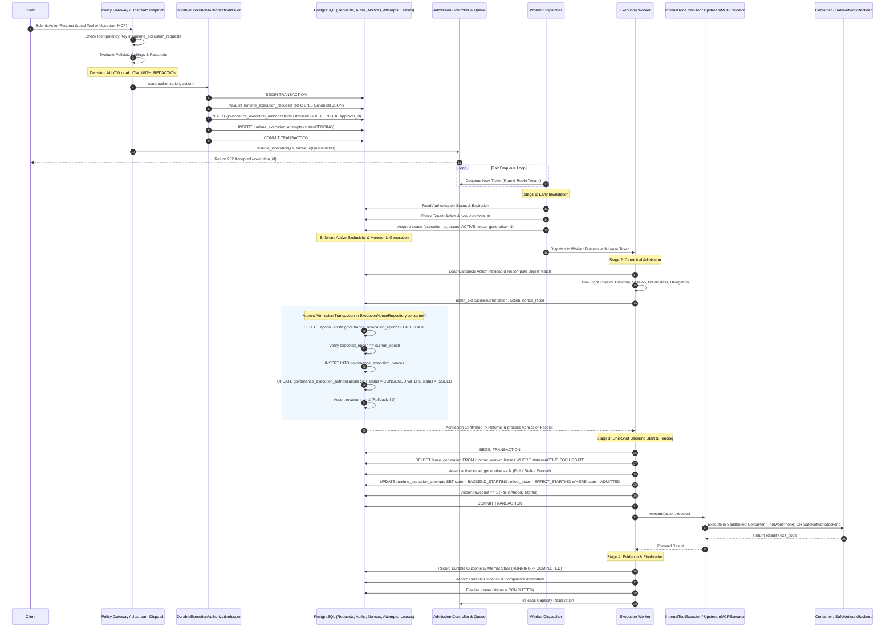

# WhitePact Phase 7A: Canonical Worker Execution Flow

**Document Status:** CANONICAL SPECIFICATION PASS 4 (SECURITY REMEDIATION)
**Target Runtime Base SHA:** `13e8de034f8b31bd7cae4f47398f71b24c923c3c` (`ENTERPRISE_AUTH_CANONICAL_SHA` — APPROVED)
**Reconciled Core Ancestor SHA:** `12810825c407960ca2aa9ada94fbae056db37290`
**Proposed Migrations:** `0049_runtime_execution_requests.py` through `0052_runtime_worker_leases.py`

---

## 1. Overview and Control Chain Invariants

This document specifies the authoritative, end-to-end execution control chain for Phase 7A.

### Core Architectural Invariants:
1. **Durable Issuance Precedes Queueing:** No `QueueTicket` may be generated until `runtime_execution_requests` and `governance_execution_authorizations` are durably committed in PostgreSQL.
2. **Single Canonical Admission Gate:** No worker may begin backend execution without successfully completing `admit_execution()` in `src/responsibleai/governance/execution.py`.
3. **One-Shot Backend Start Transition:** Possession of an `AdmissionReceipt` is insufficient to execute. Downstream execution requires an atomic transition from `ADMITTED` to `BACKEND_STARTING` in `runtime_execution_attempts` with `rowcount == 1`.
4. **Monotonic Worker Fencing:** Each lease acquisition increments `lease_generation`. A stale worker holding an expired generation cannot start backend execution.
5. **Queue Isolation:** Queue tickets (`QueueTicket`) contain strictly non-privileged pointers (`execution_id`, `authorization_id`, `org_id`, `enqueued_at`). Zero credentials in Redis.
6. **No Exactly-Once Network Promise:** If a remote network side-effect is interrupted, its outcome is marked `UNCERTAIN` and requires reconciliation; automatic blind replay is forbidden.
7. **Evidence Precedes Lease Finalization:** Result captured -> durable effect/outcome state -> durable evidence write -> mark attempt terminal -> finalize lease -> release capacity.

---

## 2. End-to-End Control Sequence Diagram

---

## 3. Step-by-Step State Transitions and Failure Exits

### Step 1: Decision & Centralized Durable Issuance
- **Actors:** `mcp/governance_integration.py` (`execute_governed_action`, `resolve_approval_and_execute`) and `mcp/upstream_dispatch.py` (`dispatch_upstream_action`).
- **Action:** Evaluates idempotency; if decision is `ALLOW` or `ALLOW_WITH_REDACTION`, issues in ONE atomic transaction:
  1. Append-only `runtime_execution_requests` row.
  2. `governance_execution_authorizations` row (`status = 'ISSUED'`).
  3. `runtime_execution_attempts` row (`state = 'PENDING'`).
- **Failure Exit:** If DB write fails, request fails closed (HTTP 500/503). Zero `QueueTicket` records emitted.

### Step 2: Admission Reservation & Queueing
- **Action:** `AdmissionController.reserve_execution()` acquires capacity.
- **Enqueuing:** Lightweight `QueueTicket` enqueued to `FairExecutionScheduler`.
- **Response:** Client receives HTTP 202 with `execution_id`.

### Step 3: Dequeue & Early Invalidation (Stage 1)
- **Actor:** Worker Dispatcher.
- **Early Checks:** `now < expires_at`, `status == 'ISSUED'`, tenant active.
- **Lease Acquisition:** Acquires `runtime_worker_leases` row with monotonic `lease_generation = N`.

### Step 4: Canonical Admission (Stage 2)
- **Actor:** Execution Worker.
- **Pre-Flight Checks:** Recomputes action digest from `canonical_action_payload`, verifies principal/session/BreakGlass.
- **Canonical Admission:** Calls `admit_execution()`, atomically locking epoch, burning nonce, updating authorization to `CONSUMED`.
- **Output:** In-process `AdmissionReceipt`.

### Step 5: One-Shot Backend Start & Fencing (Stage 3)
- **Actor:** Execution Worker.
- **Fence Verification:** Asserts `lease_generation == N` under row lock in `runtime_worker_leases`.
- **Atomic Transition:** Updates `runtime_execution_attempts` from `ADMITTED` to `BACKEND_STARTING` asserting `rowcount == 1`.
- **Failure Exit:** If `rowcount == 0` (receipt reused or worker fenced), aborts immediately.

### Step 6: Downstream Execution Without Re-Admission
- **Actor:** `InternalToolExecutor` or `UpstreamMCPExecutor`.
- **Action:** Executes container or safe network call with stable `effect_id` as idempotency key.

### Step 7: Evidence Persistence & Lease Finalization (Stage 4)
- **Order:** Result -> Outcome row -> Evidence store -> Attempt `COMPLETED` -> Lease `COMPLETED` -> Capacity released.
- **Failure Handling:** If evidence write fails after confirmed effect, attempt remains `COMPLETED` with `evidence_status = 'INCOMPLETE'` to prevent effect duplication.
