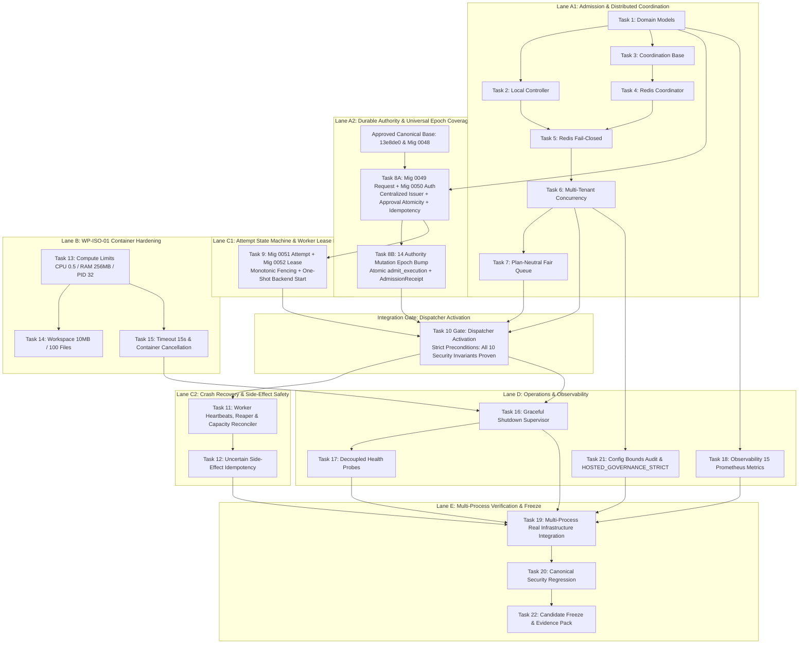

# WhitePact Phase 7A: Validated Dependency Graph & Execution Sequence

**Document Status:** CANONICAL SPECIFICATION PASS 4 (SECURITY REMEDIATION)
**Target Runtime Base SHA:** `13e8de034f8b31bd7cae4f47398f71b24c923c3c` (`ENTERPRISE_AUTH_CANONICAL_SHA` — APPROVED)
**Reconciled Core Ancestor SHA:** `12810825c407960ca2aa9ada94fbae056db37290`
**Current Migration Head:** `0048` (`migrations/versions/0048_enforce_paddle_binding_atomicity.py`)

---

## 1. Overview & Graph Invariants

This document defines the strict, mathematically sound dependency graph for Phase 7A implementation.

### Critical Graph Invariants:
1. **Linear Migration Sequencing:**
   `0048`
   -> `0049_runtime_execution_requests.py`
   -> `0050_runtime_execution_authorizations.py`
   -> `0051_runtime_execution_attempts.py`
   -> `0052_runtime_worker_leases.py`.
2. **PostgreSQL Schema Before Logic:** No repository or transaction logic may execute before its underlying migration is committed.
3. **Dispatcher Activation Gate (Task 10 Gate):** Task 10 requires all 10 security prerequisites to be fully verified in design and implementation:
   - 1. Durable immutable request storage (`0049_runtime_execution_requests`).
   - 2. Tenant-scoped idempotent issuance (`UNIQUE(organization_id, idempotency_key)`).
   - 3. All 3 production issuance paths closed via PostgreSQL persistence.
   - 4. Atomic approval consumption and authorization issuance (`UNIQUE(approval_id)`).
   - 5. Canonical admission transaction combining nonce insert and authorization status update (`rowcount == 1`).
   - 6. Universal epoch invalidation covering all 14 authority mutations.
   - 7. Monotonic worker fencing (`0052_runtime_worker_leases.lease_generation`).
   - 8. Durable attempt and effect state machine (`0051_runtime_execution_attempts`).
   - 9. One-shot backend-start transition (`ADMITTED -> BACKEND_STARTING` with `rowcount == 1`).
   - 10. Preservation of `SafeNetworkBackend` and container isolation.
   - **Zero Task 10 activation may proceed before this gate passes.**

---

## 2. Task Master Table with Explicit Prerequisite Proofs

| Task ID | Task Name | Task Category | Strict Prerequisites | Target Files | Can Run in Parallel? |
| :--- | :--- | :--- | :--- | :--- | :--- |
| **Task 1** | Admission Domain Models | SERIAL CORE | Approved Canonical Base (`13e8de0`) | `runtime/admission/models.py` | NO (Foundation) |
| **Task 2** | Local Admission Controller | SERIAL CORE | Task 1 | `runtime/admission/controller.py` | NO |
| **Task 3** | Coordination Base Contract | SERIAL CORE | Task 1 | `runtime/coordination/base.py` | YES (after Task 1) |
| **Task 4** | Redis Coordinator Implementation | SERIAL CORE | Task 3 | `runtime/coordination/redis_coordinator.py` | YES (Leaf module) |
| **Task 5** | Redis Fail-Closed Behavior | SERIAL CORE | Tasks 2, 4 | `runtime/admission/controller.py` | NO |
| **Task 6** | Integrated Multi-Tenant Concurrency | SERIAL CORE | Tasks 2, 5 | `runtime/admission/controller.py` | NO |
| **Task 7** | Bounded Fair Queue (Plan-Neutral) | SERIAL CORE | Tasks 1, 6 | `runtime/queue/*` | YES (after Task 6) |
| **Task 8A** | Durable Request Storage (Mig 0049), Auth Storage (Mig 0050), Centralized Issuer & Approval Atomicity | SERIAL CORE | Task 1, Head `0048` | `migrations/0049_*.py`, `migrations/0050_*.py`, `db/execution_request_repository.py`, `db/execution_authorization_repository.py`, `governance/execution_issuer.py`, `governance/approval_service.py` | YES (after Task 1) |
| **Task 8B** | Universal Epoch Coverage (14 Mutations), Two-Stage Revalidation & Atomic Admission | SERIAL CORE | Task 8A | `db/execution_nonce_repository.py`, `governance/execution.py`, `governance/upstream_executor.py`, `iam/session.py`, `iam/break_glass.py`, `runtime/revalidation.py` | NO (Database atomic) |
| **Task 9** | Execution Attempt Schema (Mig 0051), Worker Lease Schema (Mig 0052) & Fencing | SERIAL CORE | Task 8A | `migrations/0051_*.py`, `migrations/0052_*.py`, `runtime/worker/lease.py`, `db/execution_attempt_repository.py`, `db/admission_lease_repository.py` | NO (PostgreSQL) |
| **Task 10** | Dispatcher Activation Gate (10 Mandatory Prerequisites) | INTEGRATION GATE | Tasks 6, 7, 8B, 9 | `runtime/dispatcher.py`, `runtime/worker/worker.py`, `mcp/governance_integration.py`, `mcp/upstream_dispatch.py` | NO (Activation Gate) |
| **Task 11** | Worker Lease Heartbeat, Crash Recovery & Stale Reaper | SERIAL CORE | Task 10 | `runtime/worker/supervisor.py` | NO (Depends on Gate) |
| **Task 12** | Side-Effect Safety & Uncertain State Handling | SERIAL CORE | Task 11 | `runtime/worker/worker.py` | NO (Depends on Task 11) |
| **Task 13** | WP-ISO-01 Compute Limits (CPU/RAM/PID) | PARALLEL SUPPORT | None | `isolation/models.py`, `isolation/container_backend.py` | YES (Isolation lane) |
| **Task 14** | WP-ISO-01 Workspace Limits (10MB/100 Files) | PARALLEL SUPPORT | Task 13 | `isolation/filesystem.py` | YES (Isolation lane) |
| **Task 15** | Timeout and Cancellation | PARALLEL SUPPORT | Task 13 | `isolation/container_backend.py` | YES (Isolation lane) |
| **Task 16** | Graceful Shutdown Supervisor | INTEGRATION GATE | Tasks 10, 15 | `runtime/shutdown.py`, `dashboard/app.py` | NO |
| **Task 17** | Health Probe Decoupling (/livez, /readyz) | INTEGRATION | Task 16 | `runtime/health.py`, `dashboard/app.py` | NO |
| **Task 18** | Observability & 15 Runtime Metrics | PARALLEL SUPPORT | Task 1 | `dashboard/prometheus.py` | YES (Metrics only) |
| **Task 19** | Multi-Process Real Infrastructure Integration | INTEGRATION GATE | Tasks 1-18 | `tests/runtime/test_multi_process_*.py`, `tests/runtime/test_real_infra_*.py` | NO |
| **Task 20** | Canonical Security Regression | INTEGRATION | Task 19 | `tests/runtime/test_phase7a_security_regression.py` | NO |
| **Task 21** | Configuration Audit & Bounds Validation | PARALLEL SUPPORT | Task 6 | `dashboard/config.py` | YES |
| **Task 22** | Candidate Freeze & Evidence Pack | INTEGRATION | Tasks 20, 21 | `docs/phase7a-execution/*` | NO |

---

## 3. Corrected Dependency Graph Visualization

