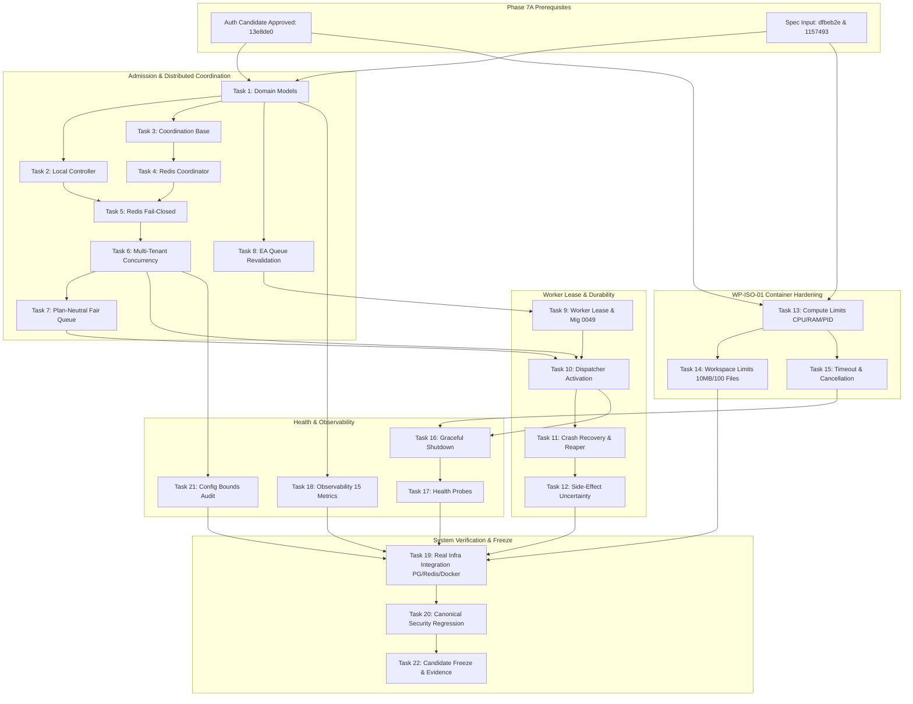

# WhitePact Phase 7A Implementation Dependency Graph

**Document Status:** CANDIDATE IMPLEMENTATION PLAN (PENDING INDEPENDENT REVIEW)
**Source Design SHA:** `dfbeb2e6d9fad575fc45b64789c63b1c1c0b5b01` (Worktree: `/Users/ag/whitepact-phase7a-runtime-preparation`)
**Target Runtime Base SHA:** `13e8de034f8b31bd7cae4f47398f71b24c923c3c` (Auth Candidate Under Codex Review)
**Reconciled Core Ancestor SHA:** `12810825c407960ca2aa9ada94fbae056db37290`
**Assumed Alembic Head:** `0048` (`migrations/versions/0048_enforce_paddle_binding_atomicity.py`, conditional upon Codex approval of `13e8de0`)

---

## 1. Architectural Categorization of Tasks

To guarantee that implementation proceeds with maximum velocity while strictly protecting canonical security boundaries, Phase 7A tasks are categorized as:

1. **SERIAL SECURITY CORE:**
   Tasks defining admission domain models, authorization revalidation, distributed semaphores, fail-closed boundaries, worker lease mutual exclusion, and side-effect guards. These must execute strictly in security-dependency order.
2. **PARALLEL-SAFE SUPPORT:**
   Tasks operating on decoupled leaves (e.g., container isolation limits, telemetry, provisional configuration validation) that share stable interfaces.
3. **INTEGRATION & GATES:**
   Tasks that join the distributed components and execute real-infrastructure multi-process validation and canonical security regression.

---

## 2. Corrected Dependency Matrix and Lane Allocation

| Task ID | Task Description | Category | Direct Pre-requisites | Files Owned | Concurrent Safe? |
| :--- | :--- | :--- | :--- | :--- | :--- |
| **Task 1** | Admission Domain Models | SERIAL CORE | Auth Candidate Approved | `runtime/admission/models.py` | NO (Foundation) |
| **Task 2** | Local Admission Controller | SERIAL CORE | Task 1 | `runtime/admission/controller.py` | NO |
| **Task 3** | Coordination Base Contract | SERIAL CORE | Task 1 | `runtime/coordination/base.py` | YES (after Task 1) |
| **Task 4** | Redis Coordinator Implementation | SERIAL CORE | Task 3 | `runtime/coordination/redis_coordinator.py` | YES (Leaf module) |
| **Task 5** | Redis Fail-Closed Behavior | SERIAL CORE | Tasks 2, 4 | `runtime/admission/controller.py` | NO |
| **Task 6** | Integrated Multi-Tenant Concurrency | SERIAL CORE | Tasks 2, 5 | `runtime/admission/controller.py` | NO |
| **Task 7** | Bounded Fair Queue (Plan-Neutral) | SERIAL CORE | Tasks 1, 6 | `runtime/queue/*` | YES (after Task 6) |
| **Task 8** | EA Queue Revalidation | SERIAL CORE | Task 1 | `runtime/revalidation.py` | YES (Leaf module) |
| **Task 9** | Worker Lease & Mig 0049 | SERIAL CORE | Task 8 | `migrations/0049_*.py`, `runtime/worker/lease.py` | NO (PostgreSQL) |
| **Task 10** | Dispatcher & Worker Decoupling | INTEGRATION | Tasks 6, 7, 9 | `runtime/dispatcher.py`, `runtime/worker/worker.py` | NO (Activation Gate) |
| **Task 11** | Crash Recovery & Reaper | SERIAL CORE | Tasks 9, 10 | `runtime/worker/supervisor.py` | NO |
| **Task 12** | Side-Effect Safety & Idempotency | SERIAL CORE | Tasks 10, 11 | `runtime/worker/worker.py` | NO |
| **Task 13** | WP-ISO-01 Compute Limits | PARALLEL SUPPORT | None | `isolation/models.py`, `isolation/container_backend.py` | YES (Isolation lane) |
| **Task 14** | WP-ISO-01 Workspace Limits | PARALLEL SUPPORT | Task 13 | `isolation/filesystem.py` | YES (Isolation lane) |
| **Task 15** | Timeout and Cancellation | PARALLEL SUPPORT | Task 13 | `isolation/container_backend.py` | YES (Isolation lane) |
| **Task 16** | Graceful Shutdown Supervisor | INTEGRATION | Tasks 10, 15 | `runtime/shutdown.py`, `dashboard/app.py` | NO |
| **Task 17** | Health Probe Decoupling | INTEGRATION | Task 16 | `runtime/health.py`, `dashboard/app.py` | NO |
| **Task 18** | Observability & Metrics | PARALLEL SUPPORT | Task 1 | `dashboard/prometheus.py` | YES (Metrics only) |
| **Task 19** | Real Infrastructure Tests | INTEGRATION | Tasks 1-18 | `tests/runtime/test_real_infra_*.py` | NO |
| **Task 20** | Canonical Security Regression | INTEGRATION | Task 19 | `tests/runtime/test_phase7a_security_regression.py` | NO |
| **Task 21** | Configuration Audit & Bounds | PARALLEL SUPPORT | Task 6 | `dashboard/config.py` | YES |
| **Task 22** | Freeze & Evidence Pack | INTEGRATION | Tasks 20, 21 | `docs/phase7a-execution/*` | NO |

---

## 3. Corrected Dependency Graph Visualization

---

## 4. Multi-Agent Concurrency Guardrails

1. **Activation Gate Enforcement:** Task 10 (Worker Dispatcher Decoupling & Activation) cannot begin until Task 5 (Redis Fail-Closed) and Task 9 (Worker Lease Contract) are green and verified.
2. **Strict File Isolation:**
   - `isolation/*` is modified exclusively in Tasks 13, 14, 15.
   - `dashboard/app.py` is modified exclusively in Tasks 16 and 17.
   - `migrations/*` is modified exclusively in Task 9.
3. **Plan-Neutrality Invariant:** No task may introduce plan-based queue weighting or priority elevation.
