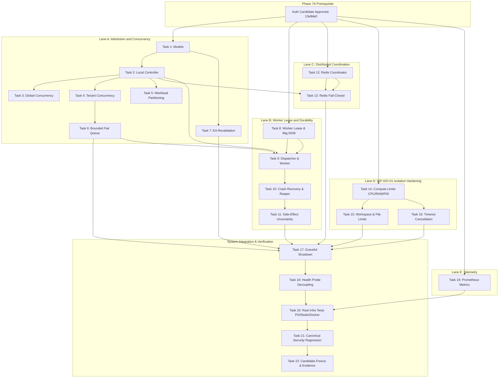

# WhitePact Phase 7A Implementation Dependency Graph

**Document Status:** Approved Architecture Specification
**Target Worktree:** `/Users/ag/whitepact-phase7a-final-plan`
**Base Candidate SHA:** `13e8de034f8b31bd7cae4f47398f71b24c923c3c`
**Ancestor SHA:** `12810825c407960ca2aa9ada94fbae056db37290`
**Current Alembic Head:** `0048` (`0048_enforce_paddle_binding_atomicity.py`)

---

## 1. Architectural Categorization of Tasks

To ensure maximum implementation velocity without risking concurrent corruption of critical security invariants, Phase 7A tasks are partitioned into three distinct operational categories:

1. **SERIAL SECURITY CORE (Red Lane):**
   Tasks that define or modify foundational governance, admission gatekeeping, worker lease mutual exclusion, and authorization revalidation. These tasks must be executed strictly serially. No two agents may concurrently edit files in this category.
2. **PARALLEL-SAFE SUPPORT (Green Lane):**
   Tasks that operate on self-contained leaf subsystems (e.g., container resource limits, observability metrics, Redis client wrappers) that share stable, decoupled interfaces. These tasks can be executed concurrently by separate agent lanes once their parent interface is stable.
3. **INTEGRATION REQUIRED (Blue Lane):**
   Tasks that join the admission controller, worker pool, isolation plane, and health systems into a unified distributed runtime. These require comprehensive end-to-end and regression testing.

---

## 2. Dependency Matrix and Lane Allocation

| Task ID | Task Description | Category | Direct Pre-requisites | Files Owned | Concurrent Safe? |
| :--- | :--- | :--- | :--- | :--- | :--- |
| **Task 1** | Admission Domain Models | SERIAL CORE | None (Auth Approval) | `runtime/admission/models.py` | NO (Foundation) |
| **Task 2** | Local Admission Controller | SERIAL CORE | Task 1 | `runtime/admission/controller.py` | NO |
| **Task 3** | Global Concurrency Limit | SERIAL CORE | Task 2 | `runtime/admission/controller.py` | NO (Shared file) |
| **Task 4** | Tenant Quota Enforcement | SERIAL CORE | Task 2 | `runtime/admission/controller.py` | NO (Shared file) |
| **Task 5** | Workload Partitioning | SERIAL CORE | Task 2 | `runtime/admission/controller.py` | NO (Shared file) |
| **Task 6** | Bounded Fair Queue | SERIAL CORE | Task 1, Task 4 | `runtime/queue/*` | YES (after Task 4) |
| **Task 7** | EA Queue Revalidation | SERIAL CORE | Task 1 | `runtime/revalidation.py` | YES (Leaf module) |
| **Task 8** | Worker Lease & Migration 0049 | SERIAL CORE | None (Database) | `migrations/0049_*.py`, `runtime/worker/lease.py` | YES (after 0048) |
| **Task 9** | Dispatcher & Worker Decoupling | INTEGRATION | Tasks 2, 6, 8 | `runtime/dispatcher.py`, `runtime/worker/worker.py` | NO |
| **Task 10** | Crash Recovery & Reaper | SERIAL CORE | Tasks 8, 9 | `runtime/worker/supervisor.py` | NO |
| **Task 11** | Side-Effect Uncertainty | SERIAL CORE | Tasks 9, 10 | `runtime/worker/worker.py` | NO |
| **Task 12** | Redis Coordinator Primitives | PARALLEL SUPPORT | None | `runtime/coordination/*` | YES (Isolated leaf) |
| **Task 13** | Redis Fail-Closed Behavior | SERIAL CORE | Tasks 2, 12 | `runtime/admission/controller.py` | NO |
| **Task 14** | WP-ISO-01 Compute Limits | PARALLEL SUPPORT | None | `isolation/models.py`, `isolation/container_backend.py` | YES (Isolation lane) |
| **Task 15** | WP-ISO-01 Workspace Limits | PARALLEL SUPPORT | Task 14 | `isolation/filesystem.py` | YES (Isolation lane) |
| **Task 16** | Timeout and Cancellation | PARALLEL SUPPORT | Task 14 | `isolation/container_backend.py` | YES (Isolation lane) |
| **Task 17** | Graceful Shutdown Supervisor | INTEGRATION | Tasks 9, 14, 16 | `runtime/shutdown.py`, `dashboard/app.py` | NO |
| **Task 18** | Health Probe Decoupling | INTEGRATION | Task 17 | `runtime/health.py`, `dashboard/app.py` | NO |
| **Task 19** | Observability & Metrics | PARALLEL SUPPORT | Task 1 | `dashboard/prometheus.py` | YES (Metrics only) |
| **Task 20** | Real Infrastructure Tests | INTEGRATION | Tasks 1-19 | `tests/runtime/test_real_infra_*.py` | NO |
| **Task 21** | Canonical Security Regression | INTEGRATION | Task 20 | `tests/runtime/test_phase7a_security_regression.py` | NO |
| **Task 22** | Freeze & Evidence Pack | INTEGRATION | Task 21 | `docs/phase7a-execution/*` | NO |

---

## 3. Dependency Graph Visualization

---

## 4. Multi-Agent Concurrency Guardrails

To prevent race conditions, merge conflicts, or divergent assumptions when multiple agents or subagents participate:

1. **Strict File Ownership:** No two active agents may touch the same file simultaneously.
2. **Boundary Stability:** Lane D (Isolation) has zero dependency on Lane A (Admission). Agent working on WP-ISO-01 can run to completion in parallel with Agent working on Admission.
3. **No Branch Divergence:** All branches merge into the central integration branch following atomic verification.
4. **Independent Review Points:** Each completed lane must undergo CodeRabbit/Codex review before integration into the master candidate branch.
