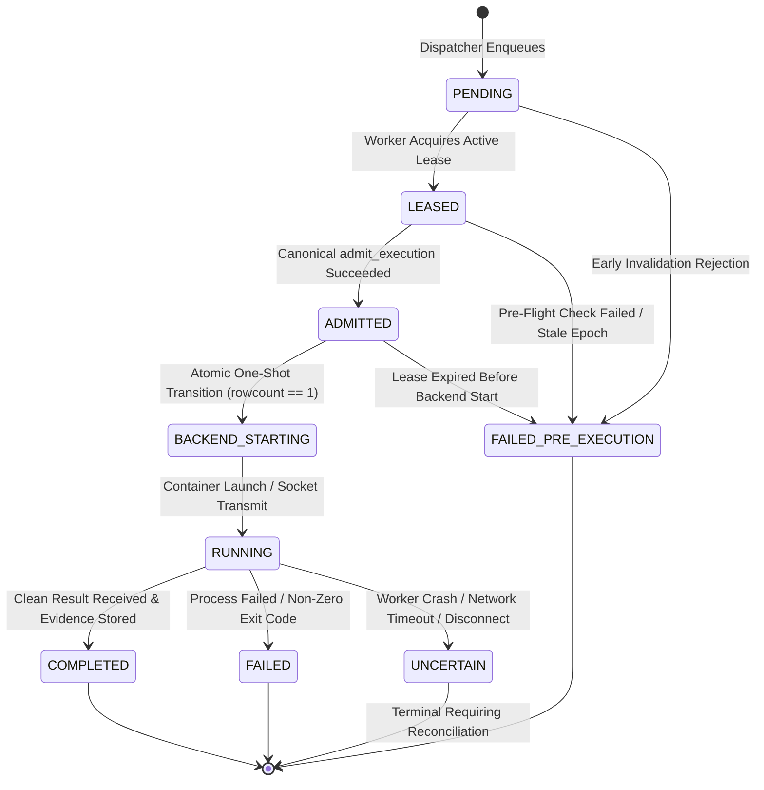

# WhitePact Phase 7A: Execution Attempt State Machine & One-Shot Backend Start

**Document Status:** CANONICAL SPECIFICATION PASS 4 (SECURITY REMEDIATION)
**Target Runtime Base SHA:** `13e8de034f8b31bd7cae4f47398f71b24c923c3c` (`ENTERPRISE_AUTH_CANONICAL_SHA` — APPROVED)
**Reconciled Core Ancestor SHA:** `12810825c407960ca2aa9ada94fbae056db37290`
**Proposed Migration:** `0051_runtime_execution_attempts.py` (down-revision: `0050`)

---

## 1. Problem Statement: The One-Shot Invariant

In previous designs, canonical admission (`admit_execution`) burned a single-use nonce in `governance_execution_nonces` and updated `governance_execution_authorizations`. However:
1. **Admission Context Replay:** Nonce consumption proves only that admission was executed once. It does NOT prevent an in-memory object from being passed to an executor twice, or a concurrent racing thread from attempting duplicate backend execution with the same admitted credentials.
2. **Dataclass Non-Proof:** An in-memory dataclass is not an unforgeable capability. Any process could theoretically instantiate it.
3. **Execution vs Effect Disconnection:** When a worker crashes after admitting a request or while transmitting an HTTP request to an upstream server, the system has no durable record of whether side-effects began or completed.

To solve this, Phase 7A strictly separates:
- **Canonical Admission:** Evaluates whether authority is currently valid (epoch freshness, nonce uniqueness, tenant binding).
- **Backend-Start Transition:** A durable, one-shot state transition in PostgreSQL that claims exclusive right to begin execution on a specific backend, preventing any replay.

---

## 2. Table Schema: `runtime_execution_attempts`

Migration `0051_runtime_execution_attempts.py` establishes the durable attempt and effect tracking table:

```sql
CREATE TABLE runtime_execution_attempts (
    attempt_id VARCHAR(64) PRIMARY KEY,
    execution_id VARCHAR(64) NOT NULL,
    authorization_id VARCHAR(64) NOT NULL,
    organization_id VARCHAR(64) NOT NULL,
    attempt_number INTEGER NOT NULL DEFAULT 1,
    worker_id VARCHAR(64) NOT NULL,
    lease_id VARCHAR(64) NOT NULL,
    lease_generation BIGINT NOT NULL,
    state VARCHAR(32) NOT NULL DEFAULT 'PENDING',
    effect_id VARCHAR(64) NOT NULL,
    effect_state VARCHAR(32) NOT NULL DEFAULT 'NO_EFFECT',
    admitted_at TIMESTAMPTZ NULL,
    backend_started_at TIMESTAMPTZ NULL,
    completed_at TIMESTAMPTZ NULL,
    failure_code VARCHAR(64) NULL,
    failure_reason TEXT NULL,
    created_at TIMESTAMPTZ NOT NULL DEFAULT CURRENT_TIMESTAMP,
    updated_at TIMESTAMPTZ NOT NULL DEFAULT CURRENT_TIMESTAMP,

    CONSTRAINT fk_attempt_exec
        FOREIGN KEY (execution_id)
        REFERENCES runtime_execution_requests(execution_id)
        ON DELETE RESTRICT,

    CONSTRAINT fk_attempt_auth
        FOREIGN KEY (authorization_id)
        REFERENCES governance_execution_authorizations(authorization_id)
        ON DELETE RESTRICT,

    CONSTRAINT fk_attempt_org
        FOREIGN KEY (organization_id)
        REFERENCES organizations(id)
        ON DELETE RESTRICT,

    CONSTRAINT chk_attempt_state
        CHECK (state IN (
            'PENDING',
            'LEASED',
            'ADMITTED',
            'BACKEND_STARTING',
            'RUNNING',
            'COMPLETED',
            'FAILED_PRE_EXECUTION',
            'FAILED',
            'UNCERTAIN'
        )),

    CONSTRAINT chk_effect_state
        CHECK (effect_state IN (
            'NO_EFFECT',
            'EFFECT_STARTING',
            'EFFECT_TRANSMITTING',
            'EFFECT_CONFIRMED',
            'EFFECT_FAILED',
            'EFFECT_UNCERTAIN'
        ))
);

-- Unique attempt numbering per execution
CREATE UNIQUE INDEX idx_attempt_exec_number
ON runtime_execution_attempts (execution_id, attempt_number);

-- Unique stable effect identifier across all attempts
CREATE UNIQUE INDEX idx_attempt_effect_id
ON runtime_execution_attempts (effect_id);

-- Enforce at most one active running attempt per execution across cluster
CREATE UNIQUE INDEX idx_attempt_active_execution
ON runtime_execution_attempts (execution_id)
WHERE state IN ('BACKEND_STARTING', 'RUNNING');

-- Lookups by authorization
CREATE INDEX idx_attempt_auth_id
ON runtime_execution_attempts (authorization_id);
```

---

## 3. Attempt States & Strict State Transitions



### Legal State Definitions:
1. **`PENDING`:** Request enqueued, waiting for worker assignment. No lease held.
2. **`LEASED`:** Worker holds an exclusive `ACTIVE` lease row in `runtime_worker_leases` and is running Stage 2 pre-flight verification.
3. **`ADMITTED`:** Canonical `admit_execution()` has committed in PostgreSQL (nonce inserted, epoch verified, authorization status set to `CONSUMED`). The worker holds an in-memory `AdmissionReceipt`. **No side effect has begun.**
4. **`BACKEND_STARTING`:** The worker has atomically claimed the right to invoke the execution backend. The database record now shows `state = 'BACKEND_STARTING'`.
5. **`RUNNING`:** Docker container process spawned or HTTP transport active.
6. **`COMPLETED`:** Backend returned clean exit code or HTTP 200; durable evidence and audit trail committed.
7. **`FAILED_PRE_EXECUTION`:** Failure occurred before backend start (e.g. lease timeout, invalid signature, stale epoch). Guaranteed `NO_EFFECT`.
8. **`FAILED`:** Backend executed and completed, but returned a deterministic tool failure or non-zero exit code.
9. **`UNCERTAIN`:** Side-effect status cannot be confirmed due to process crash or network timeout. **Automatic replay is strictly forbidden.**

---

## 4. One-Shot Backend-Start Transition

Immediately prior to handing control to `ContainerIsolationBackend.execute()` or `UpstreamMCPExecutor.execute()`, the worker executes the following atomic SQL transaction:

```sql
UPDATE runtime_execution_attempts
SET state = 'BACKEND_STARTING',
    effect_state = 'EFFECT_STARTING',
    backend_started_at = CURRENT_TIMESTAMP,
    updated_at = CURRENT_TIMESTAMP
WHERE execution_id = :execution_id
  AND attempt_id = :attempt_id
  AND authorization_id = :authorization_id
  AND worker_id = :worker_id
  AND lease_id = :lease_id
  AND lease_generation = :lease_generation
  AND state = 'ADMITTED';
```

### Exact Guard Rules:
- **`rowcount == 1` Required:** If this query returns `rowcount == 0`, the transaction rolls back and raises `BackendStartOwnershipLostError`.
- **Duplicate Protection:** If the same `AdmissionReceipt` is invoked twice (or passed to multiple executors), the second attempt sees `state = 'BACKEND_STARTING'` (not `'ADMITTED'`) and fails closed immediately.
- **Fencing Protection:** If a replacement worker was leased and incremented `lease_generation`, the old worker's generation check fails and returns `rowcount == 0`.
- **Durable Enforcement:** Downstream execution authority depends on the successful commit of this transition in PostgreSQL, NEVER on the possession of an in-memory Python object.

---

## 5. In-Process Admission Receipt (`AdmissionReceipt`)

The object returned by `admit_execution()` is reframed as an in-process **`AdmissionReceipt`**:

```python
@dataclass(frozen=True)
class AdmissionReceipt:
    """In-process receipt proving successful canonical admission.

    IMPORTANT: Possession of an AdmissionReceipt is INSUFFICIENT to execute.
    Durable backend-start acquisition (transitioning state from ADMITTED to
    BACKEND_STARTING with rowcount == 1) MUST succeed in PostgreSQL before
    any backend receives execution control.
    """
    execution_id: str
    attempt_id: str
    authorization_id: str
    organization_id: str
    principal_id: str
    action_digest: str
    target_fingerprint: str | None
    lease_id: str
    lease_generation: int
    effect_id: str
    admitted_at: datetime
    nonce: str
```

---

## 6. Durable Effect State & Stable External Identity

To handle remote MCP and HTTP executions safely:
1. **Stable Effect ID:** Each attempt is assigned a globally unique `effect_id` (UUIDv4) at attempt creation.
2. **Upstream Idempotency Token:** When invoking remote upstream MCP servers or webhooks that support idempotency keys, WhitePact transmits `effect_id` in the `Idempotency-Key` HTTP header.
3. **Transition to `EFFECT_TRANSMITTING`:** Immediately before writing bytes to the network socket, `effect_state` is updated to `'EFFECT_TRANSMITTING'`.
4. **Disruption Handling:** If a network timeout, connection reset, or worker SIGKILL occurs while `effect_state` is `'EFFECT_TRANSMITTING'`, the supervisor marks the attempt `UNCERTAIN` and `effect_state = 'EFFECT_UNCERTAIN'`.
5. **Replay Invariant:** Once an attempt reaches `EFFECT_TRANSMITTING` or `BACKEND_STARTING`, automatic retries are strictly prohibited. Recovery requires either:
   - Upstream reconciliation proving no effect was produced, or
   - An explicit human break-glass authorization.
