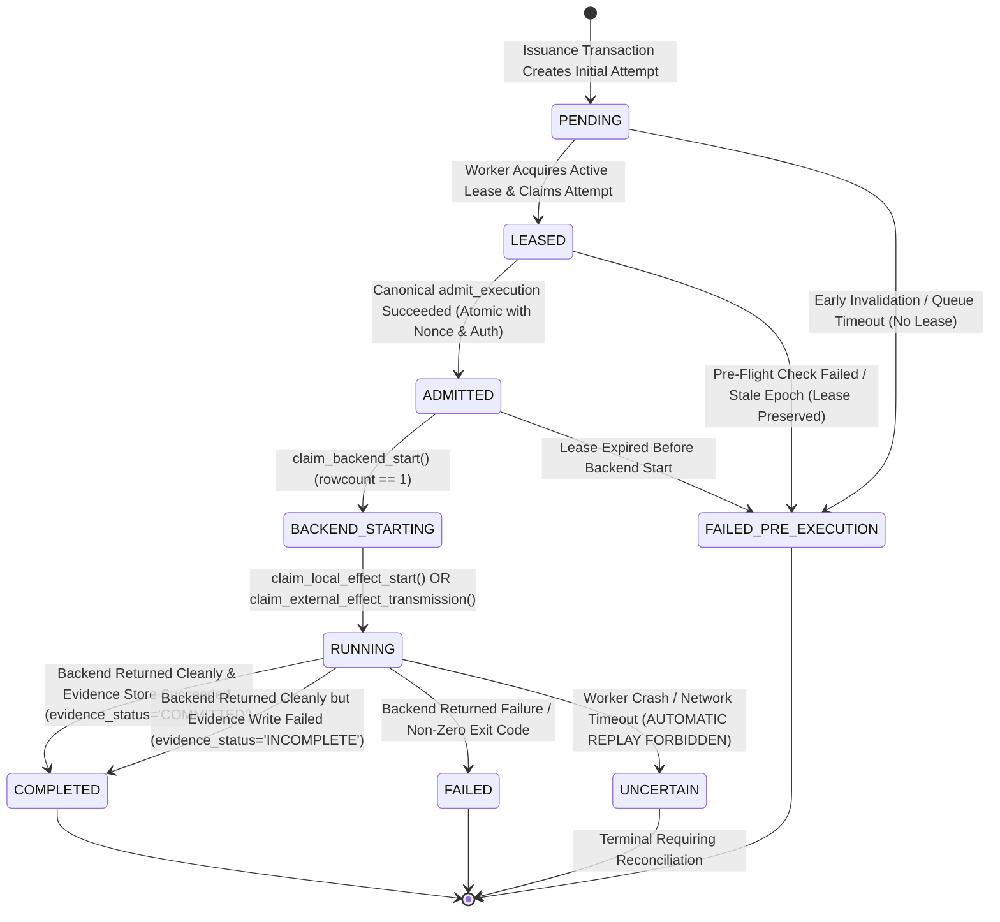

# WhitePact Phase 7A: Execution Attempt State Machine & One-Shot Backend Start

**Document Status:** CANONICAL SPECIFICATION PASS 4.2 (SECURITY CONSISTENCY CLOSURE)
**Target Runtime Base SHA:** `13e8de034f8b31bd7cae4f47398f71b24c923c3c` (`ENTERPRISE_AUTH_CANONICAL_SHA` — APPROVED)
**Reconciled Core Ancestor SHA:** `12810825c407960ca2aa9ada94fbae056db37290`
**Proposed Migration:** `0051_runtime_execution_attempts.py` (down-revision: `0050`)

---

## 1. Problem Statement: The One-Shot Invariant & Attempt Lifecycle

In asynchronous and distributed execution, execution authority, operational progress, and side-effects must be decoupled and strictly linearized:
1. **Admission Atomicity Gap (F4.2-01):** Canonical admission must not merely consume the authorization and burn the nonce; it must atomically transition the attempt from `LEASED` to `ADMITTED` in the same PostgreSQL transaction.
2. **Pre-Effect Race Closure (F4.2-02):** A check-then-write pattern (`assert_backend_start_claim` followed by `mark_running`) permits concurrent race conditions. Downstream execution requires an atomic pre-effect Compare-And-Swap (CAS) with `rowcount == 1` immediately before container launch or network socket transmission.
3. **Zero Decorative Tokens (F4.2-03):** `BackendExecutionClaim` relies on durable PostgreSQL state, exact database bindings, and atomic CAS transitions, eliminating unverified in-memory tokens.
4. **Strict Evidence Ordering & Durable Schema Ownership (F4.2-04):** Normal successful completion requires evidence persistence BEFORE attempt completion. The durable field `evidence_status` on `runtime_execution_attempts` tracks evidence state (`PENDING`, `COMMITTED`, `INCOMPLETE`).

---

## 2. Table Schema: `runtime_execution_attempts`

Migration `0051_runtime_execution_attempts.py` establishes the durable attempt and effect tracking table:

```sql
CREATE TABLE runtime_execution_attempts (
    attempt_id VARCHAR(64) PRIMARY KEY,
    execution_id VARCHAR(64) NOT NULL,
    authorization_id VARCHAR(64) NOT NULL,
    organization_id VARCHAR(64) NOT NULL,
    attempt_number INTEGER NOT NULL DEFAULT 1,
    worker_id VARCHAR(64) NULL,
    lease_id VARCHAR(64) NULL,
    lease_generation BIGINT NULL,
    state VARCHAR(32) NOT NULL DEFAULT 'PENDING',
    effect_id VARCHAR(64) NOT NULL,
    effect_state VARCHAR(32) NOT NULL DEFAULT 'NO_EFFECT',
    evidence_status VARCHAR(32) NOT NULL DEFAULT 'PENDING',
    admitted_at TIMESTAMPTZ NULL,
    backend_started_at TIMESTAMPTZ NULL,
    completed_at TIMESTAMPTZ NULL,
    failure_code VARCHAR(64) NULL,
    failure_reason TEXT NULL,
    created_at TIMESTAMPTZ NOT NULL DEFAULT CURRENT_TIMESTAMP,
    updated_at TIMESTAMPTZ NOT NULL DEFAULT CURRENT_TIMESTAMP,

    CONSTRAINT fk_attempt_exec
        FOREIGN KEY (execution_id)
        REFERENCES runtime_execution_requests(execution_id)
        ON DELETE RESTRICT,

    CONSTRAINT fk_attempt_auth
        FOREIGN KEY (authorization_id)
        REFERENCES governance_execution_authorizations(authorization_id)
        ON DELETE RESTRICT,

    CONSTRAINT fk_attempt_org
        FOREIGN KEY (organization_id)
        REFERENCES organizations(id)
        ON DELETE RESTRICT,

    CONSTRAINT chk_attempt_state
        CHECK (state IN (
            'PENDING',
            'LEASED',
            'ADMITTED',
            'BACKEND_STARTING',
            'RUNNING',
            'COMPLETED',
            'FAILED_PRE_EXECUTION',
            'FAILED',
            'UNCERTAIN'
        )),

    CONSTRAINT chk_effect_state
        CHECK (effect_state IN (
            'NO_EFFECT',
            'EFFECT_STARTING',
            'EFFECT_TRANSMITTING',
            'EFFECT_CONFIRMED',
            'EFFECT_FAILED',
            'EFFECT_UNCERTAIN'
        )),

    -- Durable evidence status ownership (F4.2-04)
    CONSTRAINT chk_attempt_evidence_status
        CHECK (evidence_status IN (
            'PENDING',
            'COMMITTED',
            'INCOMPLETE'
        )),

    -- State-dependent lease field nullability constraint (4.1-F01)
    CONSTRAINT chk_attempt_lease_fields CHECK (
        (
            state = 'PENDING'
            AND worker_id IS NULL
            AND lease_id IS NULL
            AND lease_generation IS NULL
        )
        OR
        (
            state = 'FAILED_PRE_EXECUTION'
            AND (
                -- Case A: Failed before lease assignment (queue rejection, early invalidation)
                (worker_id IS NULL AND lease_id IS NULL AND lease_generation IS NULL)
                OR
                -- Case B: Failed after lease assignment (pre-flight failure, lease expired before backend start)
                (worker_id NOT NULL AND lease_id NOT NULL AND lease_generation NOT NULL)
            )
        )
        OR
        (
            state IN ('LEASED', 'ADMITTED', 'BACKEND_STARTING', 'RUNNING', 'COMPLETED', 'FAILED', 'UNCERTAIN')
            AND worker_id NOT NULL
            AND lease_id NOT NULL
            AND lease_generation NOT NULL
        )
    )
);

-- Unique attempt numbering per execution
CREATE UNIQUE INDEX idx_attempt_exec_number
ON runtime_execution_attempts (execution_id, attempt_number);

-- Unique stable effect identifier across all attempts
CREATE UNIQUE INDEX idx_attempt_effect_id
ON runtime_execution_attempts (effect_id);

-- Enforce at most one active running attempt per execution across cluster
CREATE UNIQUE INDEX idx_attempt_active_execution
ON runtime_execution_attempts (execution_id)
WHERE state IN ('LEASED', 'ADMITTED', 'BACKEND_STARTING', 'RUNNING');

-- Lookups by authorization
CREATE INDEX idx_attempt_auth_id
ON runtime_execution_attempts (authorization_id);
```

---

## 3. Attempt States & Strict State Transitions



---

## 4. Atomic Canonical Admission Transaction: `LEASED -> ADMITTED` (F4.2-01)

The canonical admission transaction in `ExecutionNonceRepository.consume()` executes in **ONE** atomic PostgreSQL transaction on `self._engine.raw.begin()`:

```sql
BEGIN TRANSACTION;

-- 1. Lock and verify revocation epoch
SELECT epoch FROM governance_revocation_epochs
WHERE organization_id = :organization_id AND scope = 'governance'
FOR UPDATE;
-- Assert current_epoch == expected_epoch; rollback if mismatch.

-- 2. Insert single-use execution nonce
INSERT INTO governance_execution_nonces (
    nonce, execution_id, authorization_id, organization_id, consumed_at
) VALUES (
    :nonce, :execution_id, :authorization_id, :organization_id, CURRENT_TIMESTAMP
);

-- 3. Conditional authorization update: ISSUED -> CONSUMED
UPDATE governance_execution_authorizations
SET status = 'CONSUMED',
    consumed_at = CURRENT_TIMESTAMP
WHERE authorization_id = :authorization_id
  AND status = 'ISSUED'
  AND expires_at > CURRENT_TIMESTAMP;
-- Assert rowcount == 1; rollback if 0.

-- 4. Conditional attempt update: LEASED -> ADMITTED (F4.2-01)
UPDATE runtime_execution_attempts
SET state = 'ADMITTED',
    admitted_at = CURRENT_TIMESTAMP,
    updated_at = CURRENT_TIMESTAMP
WHERE attempt_id = :attempt_id
  AND execution_id = :execution_id
  AND authorization_id = :authorization_id
  AND organization_id = :organization_id
  AND worker_id = :worker_id
  AND lease_id = :lease_id
  AND lease_generation = :lease_generation
  AND state = 'LEASED';
-- Assert rowcount == 1; rollback if 0.

COMMIT;
```

### Invariants:
- If either authorization consumption or attempt transition returns `rowcount == 0`, the entire transaction rolls back.
- Nonce is never consumed if the attempt fails to reach `ADMITTED`.
- Authorization is never `CONSUMED` while attempt remains `LEASED`.
- Only upon successful commit is the `AdmissionReceipt` emitted.

---

## 5. In-Process Admission Receipt (`AdmissionReceipt`)

```python
@dataclass(frozen=True)
class AdmissionReceipt:
    """In-process receipt proving successful canonical admission.
    Possession of this receipt is INSUFFICIENT to execute.
    """
    execution_id: str
    attempt_id: str
    authorization_id: str
    organization_id: str
    principal_id: str
    action_digest: str
    target_fingerprint: str | None
    lease_id: str
    lease_generation: int
    effect_id: str
    admitted_at: datetime
    nonce: str
```

---

## 6. One-Shot Backend-Start Claim: `claim_backend_start`

Worker converts `AdmissionReceipt` into `BackendExecutionClaim` via `ExecutionAttemptRepository.claim_backend_start()`:

```sql
BEGIN TRANSACTION;

-- 1. Lock active lease and verify unexpired (expires_at > CURRENT_TIMESTAMP)
SELECT lease_generation, worker_id, lease_id, expires_at
FROM runtime_worker_leases
WHERE execution_id = :execution_id
  AND status = 'ACTIVE'
  AND expires_at > CURRENT_TIMESTAMP
FOR UPDATE;
-- Assert active lease matches worker_id, lease_id, and lease_generation; rollback if mismatch.

-- 2. Atomic one-shot transition: ADMITTED -> BACKEND_STARTING
UPDATE runtime_execution_attempts
SET state = 'BACKEND_STARTING',
    effect_state = 'EFFECT_STARTING',
    backend_started_at = CURRENT_TIMESTAMP,
    updated_at = CURRENT_TIMESTAMP
WHERE attempt_id = :attempt_id
  AND execution_id = :execution_id
  AND authorization_id = :authorization_id
  AND worker_id = :worker_id
  AND lease_id = :lease_id
  AND lease_generation = :lease_generation
  AND state = 'ADMITTED';
-- Assert rowcount == 1; rollback if 0.

COMMIT;
```

### Clean BackendExecutionClaim (F4.2-03):
```python
@dataclass(frozen=True)
class BackendExecutionClaim:
    """Durable backend-start claim proving atomic transition to BACKEND_STARTING.
    Zero decorative tokens; validity is enforced by PostgreSQL atomic CAS.
    """
    execution_id: str
    attempt_id: str
    authorization_id: str
    organization_id: str
    action_digest: str
    lease_id: str
    lease_generation: int
    effect_id: str
    started_at: datetime
```

---

## 7. Atomic Pre-Effect Compare-And-Swap (CAS) (F4.2-02)

To eliminate any read/write race condition, executors do NOT rely on a check-then-write pattern. Instead, they execute an atomic, conditional CAS update immediately prior to invoking compute or transmitting network bytes:

### 7.1 Local Container Execution: `claim_local_effect_start`
Immediately before `ContainerIsolationBackend.execute()`:
```sql
UPDATE runtime_execution_attempts
SET state = 'RUNNING',
    updated_at = CURRENT_TIMESTAMP
WHERE attempt_id = :attempt_id
  AND execution_id = :execution_id
  AND authorization_id = :authorization_id
  AND organization_id = :organization_id
  AND lease_id = :lease_id
  AND lease_generation = :lease_generation
  AND effect_id = :effect_id
  AND state = 'BACKEND_STARTING'
  AND effect_state = 'EFFECT_STARTING';
```
- **Require `rowcount == 1`:** Only the caller whose update returns 1 receives permission to spawn the container.
- If two callers concurrently pass the same `BackendExecutionClaim` to local execution, exactly ONE caller receives `rowcount == 1`. The other caller matches 0 rows and raises `ExecutionSecurityError` with zero container spawns.

### 7.2 External Network Execution: `claim_external_effect_transmission`
Immediately before writing bytes to the network socket:
```sql
UPDATE runtime_execution_attempts
SET state = 'RUNNING',
    effect_state = 'EFFECT_TRANSMITTING',
    updated_at = CURRENT_TIMESTAMP
WHERE attempt_id = :attempt_id
  AND execution_id = :execution_id
  AND authorization_id = :authorization_id
  AND organization_id = :organization_id
  AND lease_id = :lease_id
  AND lease_generation = :lease_generation
  AND effect_id = :effect_id
  AND state = 'BACKEND_STARTING'
  AND effect_state = 'EFFECT_STARTING';
```
- **Require `rowcount == 1`:** Only the caller whose update returns 1 receives permission to transmit bytes to the socket.
- Concurrent callers: exactly ONE transmits bytes; the second matches 0 rows and fails closed without transmitting a single byte.

---

## 8. Evidence Persistence and Completion Ordering (F4.2-04)

Normal successful execution follows this strict sequence:
1. **Backend Returns Clean Result:** Tool exit code 0 or HTTP 200 received.
2. **Durable Outcome Persisted:** Output payload and execution summary recorded in PostgreSQL.
3. **Durable Evidence Persisted:** `EvidenceStore.store_execution_evidence()` successfully commits cryptographic attestation.
4. **Attempt Terminal Transition (Success):**
   ```sql
   UPDATE runtime_execution_attempts
   SET state = 'COMPLETED',
       effect_state = 'EFFECT_CONFIRMED',
       evidence_status = 'COMMITTED',
       completed_at = CURRENT_TIMESTAMP,
       updated_at = CURRENT_TIMESTAMP
   WHERE attempt_id = :attempt_id
     AND state = 'RUNNING';
   ```
5. **Lease Finalized:** Worker lease transitioned to `status = 'COMPLETED'`.
6. **Capacity Released:** `AdmissionController.release_execution()`.

### Incomplete Evidence Handling:
If the external side-effect succeeded cleanly but `EvidenceStore` persistence fails:
- The external effect MUST NOT be re-executed.
- Attempt transitions to `COMPLETED` with `evidence_status = 'INCOMPLETE'`:
  ```sql
  UPDATE runtime_execution_attempts
  SET state = 'COMPLETED',
      effect_state = 'EFFECT_CONFIRMED',
      evidence_status = 'INCOMPLETE',
      completed_at = CURRENT_TIMESTAMP,
      updated_at = CURRENT_TIMESTAMP
  WHERE attempt_id = :attempt_id
    AND state = 'RUNNING';
  ```
- Lease is finalized (`COMPLETED`) and capacity is released.
- A background audit job re-attests the evidence bundle from the durable outcome row.

---

## 9. Future Concurrency & Replay Test Requirements (F4.2-05)

The following tests are required for implementation verification:
1. **Concurrent Local Claim Replay:** Two parallel tasks invoke `InternalToolExecutor.execute()` with the same `BackendExecutionClaim`. Exactly one container executes; second task raises `ExecutionSecurityError`.
2. **Concurrent Upstream Claim Replay:** Two parallel tasks invoke `UpstreamMCPExecutor.execute()` with the same `BackendExecutionClaim`. Exactly one socket transmission occurs; second task fails closed before transmitting bytes.
3. **Fabricated Claim Test:** Calling executor with fabricated `BackendExecutionClaim` (matching visible IDs but absent/invalid state in PostgreSQL) raises `ExecutionSecurityError` with zero backend calls.
4. **Stale Claim After RUNNING:** Passing a claim for an attempt already in `RUNNING` state returns `rowcount == 0` and fails closed.
5. **Stale Claim After Terminal:** Passing a claim for an attempt in `COMPLETED`, `FAILED`, or `UNCERTAIN` state returns `rowcount == 0` and fails closed.
6. **Admission Transaction Atomicity:** Simulate DB error during attempt update: verify authorization remains `ISSUED`, nonce is uninserted, attempt remains `LEASED`.
7. **Attempt Mismatch Rejection:** Simulate attempt update with wrong `worker_id` or `lease_generation`: admission transaction rolls back completely.
