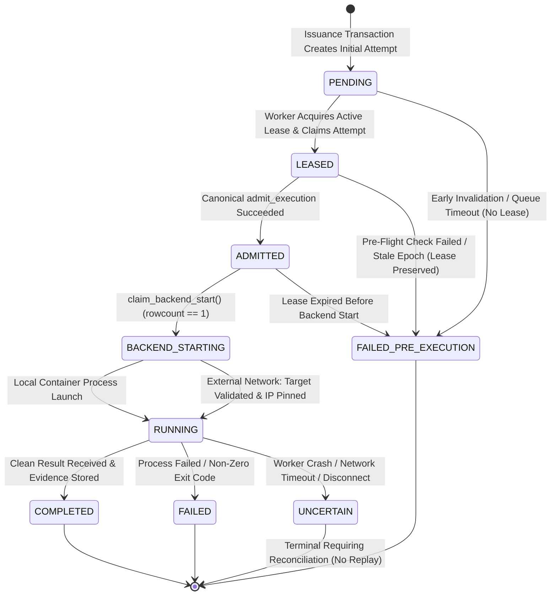

# WhitePact Phase 7A: Execution Attempt State Machine & One-Shot Backend Start

**Document Status:** CANONICAL SPECIFICATION PASS 4.1 (SECURITY CONSISTENCY REMEDIATION)
**Target Runtime Base SHA:** `13e8de034f8b31bd7cae4f47398f71b24c923c3c` (`ENTERPRISE_AUTH_CANONICAL_SHA` — APPROVED)
**Reconciled Core Ancestor SHA:** `12810825c407960ca2aa9ada94fbae056db37290`
**Proposed Migration:** `0051_runtime_execution_attempts.py` (down-revision: `0050`)

---

## 1. Problem Statement: The One-Shot Invariant & Attempt Lifecycle

In asynchronous and distributed execution, execution authority and operational progress must be decoupled and strictly tracked:
1. **Admission Context Replay:** Nonce consumption proves only that admission was executed once. It does NOT prevent an in-memory object from being passed to an executor twice, or a concurrent racing thread from attempting duplicate backend execution with the same admitted credentials.
2. **Dataclass Non-Proof:** An in-memory dataclass is not an unforgeable capability. Any process could instantiate it. Downstream execution authority depends strictly on durable PostgreSQL state.
3. **Execution vs Effect Disconnection:** When a worker crashes after admitting a request or while transmitting an HTTP request to an upstream server, the system must have a durable record of whether side-effects began or completed.
4. **Attempt Exists Before Lease:** The initial attempt is created in `PENDING` state during durable issuance before worker assignment. Consequently, lease-specific fields (`worker_id`, `lease_id`, `lease_generation`) are nullable in `PENDING` and become strictly mandatory upon transition to `LEASED`.

To solve this, Phase 7A strictly separates:
- **Canonical Admission:** Evaluates whether authority is currently valid (epoch freshness, nonce uniqueness, tenant binding). Returns in-process `AdmissionReceipt`.
- **Backend-Start Claim:** A durable, one-shot state transition in PostgreSQL (`claim_backend_start`) that verifies worker lease validity/generation and claims the exclusive right to begin execution on a specific backend, returning `BackendExecutionClaim`.
- **Durable Executor Verification:** Downstream executors verify the `BackendExecutionClaim` against PostgreSQL before side-effects begin.

---

## 2. Table Schema: `runtime_execution_attempts`

Migration `0051_runtime_execution_attempts.py` establishes the durable attempt and effect tracking table:

```sql
CREATE TABLE runtime_execution_attempts (
    attempt_id VARCHAR(64) PRIMARY KEY,
    execution_id VARCHAR(64) NOT NULL,
    authorization_id VARCHAR(64) NOT NULL,
    organization_id VARCHAR(64) NOT NULL,
    attempt_number INTEGER NOT NULL DEFAULT 1,
    worker_id VARCHAR(64) NULL,
    lease_id VARCHAR(64) NULL,
    lease_generation BIGINT NULL,
    state VARCHAR(32) NOT NULL DEFAULT 'PENDING',
    effect_id VARCHAR(64) NOT NULL,
    effect_state VARCHAR(32) NOT NULL DEFAULT 'NO_EFFECT',
    admitted_at TIMESTAMPTZ NULL,
    backend_started_at TIMESTAMPTZ NULL,
    completed_at TIMESTAMPTZ NULL,
    failure_code VARCHAR(64) NULL,
    failure_reason TEXT NULL,
    created_at TIMESTAMPTZ NOT NULL DEFAULT CURRENT_TIMESTAMP,
    updated_at TIMESTAMPTZ NOT NULL DEFAULT CURRENT_TIMESTAMP,

    CONSTRAINT fk_attempt_exec
        FOREIGN KEY (execution_id)
        REFERENCES runtime_execution_requests(execution_id)
        ON DELETE RESTRICT,

    CONSTRAINT fk_attempt_auth
        FOREIGN KEY (authorization_id)
        REFERENCES governance_execution_authorizations(authorization_id)
        ON DELETE RESTRICT,

    CONSTRAINT fk_attempt_org
        FOREIGN KEY (organization_id)
        REFERENCES organizations(id)
        ON DELETE RESTRICT,

    CONSTRAINT chk_attempt_state
        CHECK (state IN (
            'PENDING',
            'LEASED',
            'ADMITTED',
            'BACKEND_STARTING',
            'RUNNING',
            'COMPLETED',
            'FAILED_PRE_EXECUTION',
            'FAILED',
            'UNCERTAIN'
        )),

    CONSTRAINT chk_effect_state
        CHECK (effect_state IN (
            'NO_EFFECT',
            'EFFECT_STARTING',
            'EFFECT_TRANSMITTING',
            'EFFECT_CONFIRMED',
            'EFFECT_FAILED',
            'EFFECT_UNCERTAIN'
        )),

    -- State-dependent lease field nullability constraint (4.1-F01)
    CONSTRAINT chk_attempt_lease_fields CHECK (
        (
            state = 'PENDING'
            AND worker_id IS NULL
            AND lease_id IS NULL
            AND lease_generation IS NULL
        )
        OR
        (
            state = 'FAILED_PRE_EXECUTION'
            AND (
                -- Case A: Failed before lease assignment (queue rejection, early invalidation)
                (worker_id IS NULL AND lease_id IS NULL AND lease_generation IS NULL)
                OR
                -- Case B: Failed after lease assignment (pre-flight failure, lease expired before backend start)
                (worker_id IS NOT NULL AND lease_id IS NOT NULL AND lease_generation IS NOT NULL)
            )
        )
        OR
        (
            state IN ('LEASED', 'ADMITTED', 'BACKEND_STARTING', 'RUNNING', 'COMPLETED', 'FAILED', 'UNCERTAIN')
            AND worker_id NOT NULL
            AND lease_id NOT NULL
            AND lease_generation NOT NULL
        )
    )
);

-- Unique attempt numbering per execution
CREATE UNIQUE INDEX idx_attempt_exec_number
ON runtime_execution_attempts (execution_id, attempt_number);

-- Unique stable effect identifier across all attempts
CREATE UNIQUE INDEX idx_attempt_effect_id
ON runtime_execution_attempts (effect_id);

-- Enforce at most one active running attempt per execution across cluster (4.1-F15)
CREATE UNIQUE INDEX idx_attempt_active_execution
ON runtime_execution_attempts (execution_id)
WHERE state IN ('LEASED', 'ADMITTED', 'BACKEND_STARTING', 'RUNNING');

-- Lookups by authorization
CREATE INDEX idx_attempt_auth_id
ON runtime_execution_attempts (authorization_id);
```

---

## 3. Attempt States & Strict State Transitions



### Legal State Definitions:
1. **`PENDING`:** Request enqueued, waiting for worker assignment. No lease held (`worker_id`, `lease_id`, `lease_generation` are all NULL).
2. **`LEASED`:** Worker holds an exclusive `ACTIVE` lease row in `runtime_worker_leases` and is running Stage 2 pre-flight verification. All three lease fields are NOT NULL.
3. **`ADMITTED`:** Canonical `admit_execution()` has committed in PostgreSQL (nonce inserted, epoch verified, authorization status set to `CONSUMED`). The worker holds an in-process `AdmissionReceipt`. **No side effect has begun.**
4. **`BACKEND_STARTING`:** Worker has durably called `claim_backend_start()`, verified lease generation and unexpired lease status under lock, and transitioned attempt to `BACKEND_STARTING`. Worker holds `BackendExecutionClaim`.
5. **`RUNNING`:** Docker container process spawned or socket transmission in progress.
6. **`COMPLETED`:** Backend returned clean exit code or HTTP 200; durable evidence and audit trail committed.
7. **`FAILED_PRE_EXECUTION`:** Failure occurred before backend start (e.g. queue drop, lease timeout, invalid signature, stale epoch). Guaranteed `NO_EFFECT`.
8. **`FAILED`:** Backend executed and completed, but returned a deterministic tool failure or non-zero exit code.
9. **`UNCERTAIN`:** Side-effect status cannot be confirmed due to process crash or network timeout. **Automatic replay is strictly forbidden.**

---

## 4. Atomic Transition: `PENDING -> LEASED`

When a worker is assigned a dequeued ticket and acquires an active lease in `runtime_worker_leases`, it transitions the attempt row atomically:

```sql
UPDATE runtime_execution_attempts
SET state = 'LEASED',
    worker_id = :worker_id,
    lease_id = :lease_id,
    lease_generation = :lease_generation,
    updated_at = CURRENT_TIMESTAMP
WHERE attempt_id = :attempt_id
  AND state = 'PENDING';
```

If this query returns `rowcount == 0`, the transition failed (e.g. attempt was cancelled, early invalidated, or acquired by another worker). The worker immediately releases the acquired lease and capacity reservation.

---

## 5. Canonical Backend-Start API: `claim_backend_start`

The canonical backend-start API is owned by `ExecutionAttemptRepository`:

```python
async def claim_backend_start(
    self,
    receipt: AdmissionReceipt,
    worker_id: str,
    lease_id: str,
    lease_generation: int,
) -> BackendExecutionClaim:
    ...
```

### Internal Atomic SQL Execution:
```sql
BEGIN TRANSACTION;

-- 1. Lock and synchronously verify active, unexpired lease (4.1-F05)
SELECT lease_generation, worker_id, lease_id, expires_at
FROM runtime_worker_leases
WHERE execution_id = :execution_id
  AND status = 'ACTIVE'
  AND expires_at > CURRENT_TIMESTAMP
FOR UPDATE;

-- Assert: row exists, worker_id matches, lease_id matches, lease_generation matches.
-- If mismatch or row missing: ROLLBACK and raise ZombieWorkerFencedError or LeaseExpiredError.

-- 2. Execute one-shot backend-start transition
UPDATE runtime_execution_attempts
SET state = 'BACKEND_STARTING',
    effect_state = 'EFFECT_STARTING',
    backend_started_at = CURRENT_TIMESTAMP,
    updated_at = CURRENT_TIMESTAMP
WHERE attempt_id = :attempt_id
  AND execution_id = :execution_id
  AND authorization_id = :authorization_id
  AND worker_id = :worker_id
  AND lease_id = :lease_id
  AND lease_generation = :lease_generation
  AND state = 'ADMITTED';

-- Assert: rowcount == 1.
-- If rowcount == 0: ROLLBACK and raise BackendStartOwnershipLostError.

COMMIT;
```

Upon commit, `claim_backend_start` returns a `BackendExecutionClaim`.

---

## 6. Durable Capability Proof: `BackendExecutionClaim`

The `BackendExecutionClaim` is the ONLY credential accepted by downstream executors:

```python
@dataclass(frozen=True)
class BackendExecutionClaim:
    """Durable backend-start claim proving atomic transition to BACKEND_STARTING.
    Possession of this claim alone is not authority; executors must perform
    assert_backend_start_claim(claim) against PostgreSQL before side-effects.
    """
    execution_id: str
    attempt_id: str
    authorization_id: str
    organization_id: str
    action_digest: str
    lease_id: str
    lease_generation: int
    effect_id: str
    backend_start_token: str
    started_at: datetime
```

---

## 7. Downstream Executor Verification: `assert_backend_start_claim`

To close the direct executor bypass (4.1-F03), executors (`InternalToolExecutor`, `UpstreamMCPExecutor`) do NOT accept `AdmissionReceipt`. They accept `claim: BackendExecutionClaim`.

Before invoking `ContainerIsolationBackend` or writing bytes to a network socket, the executor executes:

```python
await execution_attempt_repo.assert_backend_start_claim(claim)
```

### Verification Query:
```sql
SELECT state, effect_state, lease_id, lease_generation, effect_id, action_digest
FROM runtime_execution_attempts a
JOIN runtime_execution_requests r ON a.execution_id = r.execution_id
WHERE a.attempt_id = :attempt_id
  AND a.execution_id = :execution_id
  AND a.authorization_id = :authorization_id
  AND a.organization_id = :organization_id;
```

### Exact Assertions:
1. Attempt row exists and bindings match.
2. `state == 'BACKEND_STARTING'` (fails if still `ADMITTED`, already `RUNNING`, or terminal).
3. `lease_id == claim.lease_id` and `lease_generation == claim.lease_generation`.
4. `effect_id == claim.effect_id`.
5. `action_digest == claim.action_digest`.

If any assertion fails, executor raises `ExecutionSecurityError` without invoking the backend. A caller fabricating a Python claim object without prior committed PostgreSQL transition cannot cause backend execution.

---

## 8. Effect State Transitions: Local vs External Boundaries

### 8.1 Local Container Execution
1. Worker acquires `BackendExecutionClaim`.
2. Executor verifies claim with `assert_backend_start_claim(claim)`.
3. Worker sets attempt `state = 'RUNNING'`.
4. `ContainerIsolationBackend.execute()` launches container (`--network=none`).
5. On completion, result captured, evidence persisted, attempt marked `COMPLETED`.

### 8.2 External Network Execution (Remote MCP / HTTP)
1. Worker acquires `BackendExecutionClaim`.
2. `UpstreamMCPExecutor` verifies claim with `assert_backend_start_claim(claim)`.
3. `SafeNetworkBackend` resolves target DNS, validates target fingerprint against authorization, and pins the resolved IP address.
4. **Immediate Pre-Socket Transition (4.1-F11):**
   Immediately before the first byte is written to the socket, `SafeNetworkBackend` durably updates:
   ```sql
   UPDATE runtime_execution_attempts
   SET effect_state = 'EFFECT_TRANSMITTING',
       state = 'RUNNING',
       updated_at = CURRENT_TIMESTAMP
   WHERE attempt_id = :attempt_id
     AND state = 'BACKEND_STARTING';
   ```
5. Safe network transport transmits HTTP request to pinned IP with `effect_id` header.
6. **Crash Boundary:** If worker dies after `EFFECT_TRANSMITTING` commit but before response receipt, supervisor marks attempt `UNCERTAIN` / `EFFECT_UNCERTAIN`. Automatic replay is strictly forbidden.

---

## 9. Attempt Retry Semantics (4.1-F14)

### 9.1 Pre-Admission Retries
If an attempt fails before canonical admission (e.g. worker dies during preflight, queue timeout, or lease expires while in `LEASED`):
- The authorization remains `status = 'ISSUED'` (nonce is unburned).
- If retry count < max attempts: Requeue creates a **new attempt row** with `attempt_number = prev.attempt_number + 1` and `state = 'PENDING'`.
- The prior attempt is marked `state = 'FAILED_PRE_EXECUTION'`.
- At most ONE attempt per authorization can ever reach `ADMITTED`.

### 9.2 Post-Admission Retries Strictly Prohibited
Once an attempt reaches `ADMITTED`:
- Authorization status is set to `CONSUMED` in the same transaction that burns the single-use nonce.
- A consumed authorization CANNOT be reused by another attempt.
- If a post-admission crash occurs, attempt enters `FAILED_PRE_EXECUTION` or `UNCERTAIN`.
- To re-execute, the client MUST submit a new `ActionRequest` and receive a fresh governance authorization.
