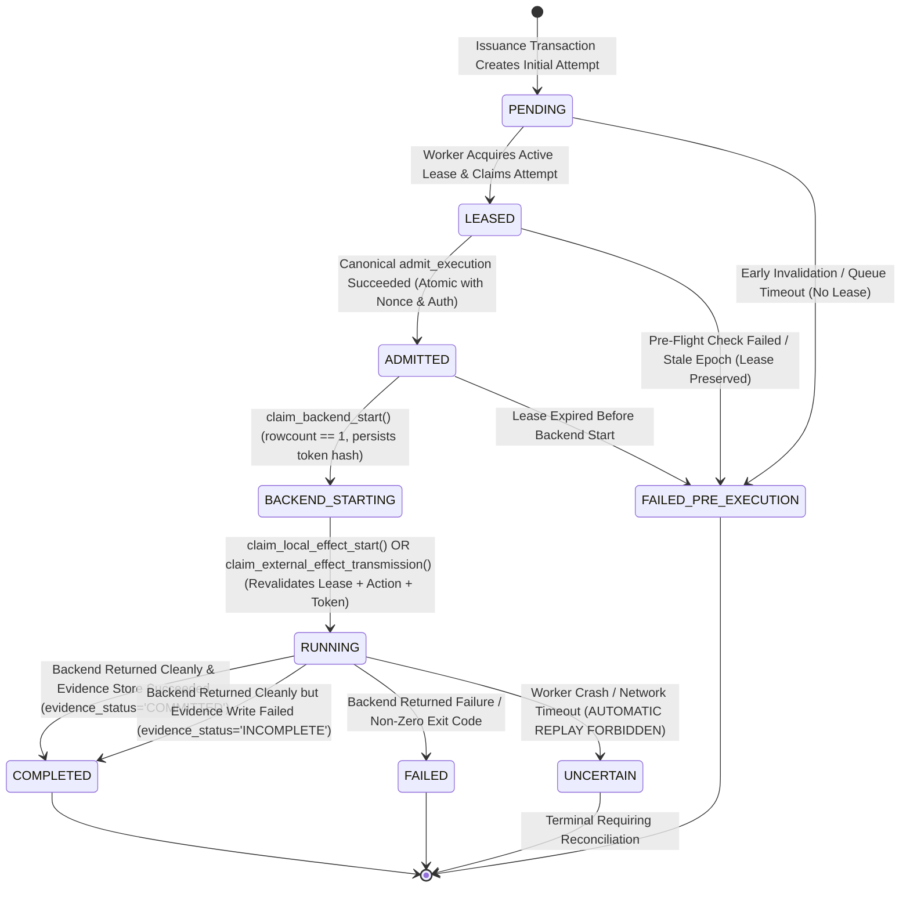

# WhitePact Phase 7A: Execution Attempt State Machine & One-Shot Backend Start

**Document Status:** CANONICAL SPECIFICATION PASS 4.3 (SECURITY BOUNDARY CLOSURE)
**Target Runtime Base SHA:** `13e8de034f8b31bd7cae4f47398f71b24c923c3c` (`ENTERPRISE_AUTH_CANONICAL_SHA` — APPROVED)
**Reconciled Core Ancestor SHA:** `12810825c407960ca2aa9ada94fbae056db37290`
**Proposed Migration:** `0051_runtime_execution_attempts.py` (down-revision: `0050`)

---

## 1. Problem Statement: The One-Shot Invariant & Attempt Lifecycle

In asynchronous and distributed execution, execution authority, operational progress, and side-effects must be decoupled and strictly linearized:
1. **Admission Atomicity Gap (F4.2-01):** Canonical admission must not merely consume the authorization and burn the nonce; it must atomically transition the attempt from `LEASED` to `ADMITTED` in the same PostgreSQL transaction (`rowcount == 1`).
2. **Synchronous Lease Revalidation at Final CAS (F4.3-01):** A pre-effect CAS that checks only the attempt row is vulnerable to worker pause/GC stalls where a lease expires or is superseded before the CAS executes. Both `claim_local_effect_start()` and `claim_external_effect_transmission()` must execute as a PostgreSQL transaction that synchronously verifies the CURRENT active unexpired lease under row lock immediately prior to winning the side-effect boundary. Fencing correctness does not depend on background reaper timing.
3. **Non-Reconstructible Backend Claim & Action Binding (F4.3-02):** A plain dataclass of visible public IDs is reconstructible. During `claim_backend_start()`, a cryptographically random secret token (`backend_start_token`) is generated and returned raw in `BackendExecutionClaim`, while ONLY its cryptographic hash (`backend_start_token_hash`) is persisted in PostgreSQL. The final pre-effect CAS verifies the token hash, verifies the immutable durable request `action_digest`, and consumes the token (`backend_start_token_hash = NULL`).
4. **Target Fingerprint Contract (F4.3-03):** `BackendExecutionClaim` carries `target_fingerprint: str | None` sourced from the durable authorization/request. Upstream execution enforces that caller-provided fingerprints cannot override the durable authorization fingerprint, resolves the target via `SafeNetworkBackend`, and pins the IP before the final CAS.
5. **Evidence Crash Consistency (F4.3-04):** `EvidenceStore` commits its durable record while attempt `evidence_status` remains `PENDING` in state `RUNNING`. The terminal attempt CAS sets `state = 'COMPLETED'`, `effect_state = 'EFFECT_CONFIRMED'`, and `evidence_status = 'COMMITTED'`. If a crash occurs after EvidenceStore commit but before attempt terminalization, supervisor/reconciler detects the durable evidence record and completes the attempt.

---

## 2. Table Schema: `runtime_execution_attempts`

Migration `0051_runtime_execution_attempts.py` establishes the durable attempt and effect tracking table:

```sql
CREATE TABLE runtime_execution_attempts (
    attempt_id VARCHAR(64) PRIMARY KEY,
    execution_id VARCHAR(64) NOT NULL,
    authorization_id VARCHAR(64) NOT NULL,
    organization_id VARCHAR(64) NOT NULL,
    attempt_number INTEGER NOT NULL DEFAULT 1,
    worker_id VARCHAR(64) NULL,
    lease_id VARCHAR(64) NULL,
    lease_generation BIGINT NULL,
    state VARCHAR(32) NOT NULL DEFAULT 'PENDING',
    effect_id VARCHAR(64) NOT NULL,
    effect_state VARCHAR(32) NOT NULL DEFAULT 'NO_EFFECT',
    evidence_status VARCHAR(32) NOT NULL DEFAULT 'PENDING',
    backend_start_token_hash VARCHAR(64) NULL, -- SHA-256 hash of single-use raw token (F4.3-02)
    admitted_at TIMESTAMPTZ NULL,
    backend_started_at TIMESTAMPTZ NULL,
    completed_at TIMESTAMPTZ NULL,
    failure_code VARCHAR(64) NULL,
    failure_reason TEXT NULL,
    created_at TIMESTAMPTZ NOT NULL DEFAULT CURRENT_TIMESTAMP,
    updated_at TIMESTAMPTZ NOT NULL DEFAULT CURRENT_TIMESTAMP,

    CONSTRAINT fk_attempt_exec
        FOREIGN KEY (execution_id)
        REFERENCES runtime_execution_requests(execution_id)
        ON DELETE RESTRICT,

    CONSTRAINT fk_attempt_auth
        FOREIGN KEY (authorization_id)
        REFERENCES governance_execution_authorizations(authorization_id)
        ON DELETE RESTRICT,

    CONSTRAINT fk_attempt_org
        FOREIGN KEY (organization_id)
        REFERENCES organizations(id)
        ON DELETE RESTRICT,

    CONSTRAINT chk_attempt_state
        CHECK (state IN (
            'PENDING',
            'LEASED',
            'ADMITTED',
            'BACKEND_STARTING',
            'RUNNING',
            'COMPLETED',
            'FAILED_PRE_EXECUTION',
            'FAILED',
            'UNCERTAIN'
        )),

    CONSTRAINT chk_effect_state
        CHECK (effect_state IN (
            'NO_EFFECT',
            'EFFECT_STARTING',
            'EFFECT_TRANSMITTING',
            'EFFECT_CONFIRMED',
            'EFFECT_FAILED',
            'EFFECT_UNCERTAIN'
        )),

    -- Durable evidence status ownership (F4.2-04, F4.3-04)
    CONSTRAINT chk_attempt_evidence_status
        CHECK (evidence_status IN (
            'PENDING',
            'COMMITTED',
            'INCOMPLETE'
        )),

    -- State-dependent lease field nullability constraint (4.1-F01)
    CONSTRAINT chk_attempt_lease_fields CHECK (
        (
            state = 'PENDING'
            AND worker_id IS NULL
            AND lease_id IS NULL
            AND lease_generation IS NULL
        )
        OR
        (
            state = 'FAILED_PRE_EXECUTION'
            AND (
                -- Case A: Failed before lease assignment (queue rejection, early invalidation)
                (worker_id IS NULL AND lease_id IS NULL AND lease_generation IS NULL)
                OR
                -- Case B: Failed after lease assignment (pre-flight failure, lease expired before backend start)
                (worker_id IS NOT NULL AND lease_id NOT NULL AND lease_generation NOT NULL)
            )
        )
        OR
        (
            state IN ('LEASED', 'ADMITTED', 'BACKEND_STARTING', 'RUNNING', 'COMPLETED', 'FAILED', 'UNCERTAIN')
            AND worker_id NOT NULL
            AND lease_id NOT NULL
            AND lease_generation NOT NULL
        )
    )
);

-- Unique attempt numbering per execution
CREATE UNIQUE INDEX idx_attempt_exec_number
ON runtime_execution_attempts (execution_id, attempt_number);

-- Unique stable effect identifier across all attempts
CREATE UNIQUE INDEX idx_attempt_effect_id
ON runtime_execution_attempts (effect_id);

-- Enforce at most one active running attempt per execution across cluster
CREATE UNIQUE INDEX idx_attempt_active_execution
ON runtime_execution_attempts (execution_id)
WHERE state IN ('LEASED', 'ADMITTED', 'BACKEND_STARTING', 'RUNNING');

-- Lookups by authorization
CREATE INDEX idx_attempt_auth_id
ON runtime_execution_attempts (authorization_id);
```

---

## 3. Attempt States & Strict State Transitions



---

## 4. Atomic Canonical Admission Transaction: `LEASED -> ADMITTED` (F4.2-01)

The canonical admission transaction in `ExecutionNonceRepository.consume()` executes in **ONE** atomic PostgreSQL transaction on `self._engine.raw.begin()`:

```sql
BEGIN TRANSACTION;

-- 1. Lock and verify revocation epoch
SELECT epoch FROM governance_revocation_epochs
WHERE organization_id = :organization_id AND scope = 'governance'
FOR UPDATE;
-- Assert current_epoch == expected_epoch; rollback if mismatch.

-- 2. Insert single-use execution nonce
INSERT INTO governance_execution_nonces (
    nonce, execution_id, authorization_id, organization_id, consumed_at
) VALUES (
    :nonce, :execution_id, :authorization_id, :organization_id, CURRENT_TIMESTAMP
);

-- 3. Conditional authorization update: ISSUED -> CONSUMED
UPDATE governance_execution_authorizations
SET status = 'CONSUMED',
    consumed_at = CURRENT_TIMESTAMP
WHERE authorization_id = :authorization_id
  AND status = 'ISSUED'
  AND expires_at > CURRENT_TIMESTAMP;
-- Assert rowcount == 1; rollback if 0.

-- 4. Conditional attempt update: LEASED -> ADMITTED (F4.2-01)
UPDATE runtime_execution_attempts
SET state = 'ADMITTED',
    admitted_at = CURRENT_TIMESTAMP,
    updated_at = CURRENT_TIMESTAMP
WHERE attempt_id = :attempt_id
  AND execution_id = :execution_id
  AND authorization_id = :authorization_id
  AND organization_id = :organization_id
  AND worker_id = :worker_id
  AND lease_id = :lease_id
  AND lease_generation = :lease_generation
  AND state = 'LEASED';
-- Assert rowcount == 1; rollback if 0.

COMMIT;
```

### Invariants:
- If either authorization consumption or attempt transition returns `rowcount == 0`, the entire transaction rolls back.
- Nonce is never consumed if the attempt fails to reach `ADMITTED`.
- Authorization is never `CONSUMED` while attempt remains `LEASED`.
- Only upon successful commit is the `AdmissionReceipt` emitted.

---

## 5. In-Process Admission Receipt (`AdmissionReceipt`)

```python
@dataclass(frozen=True)
class AdmissionReceipt:
    """In-process receipt proving successful canonical admission.
    Possession of this receipt is INSUFFICIENT to execute.
    """
    execution_id: str
    attempt_id: str
    authorization_id: str
    organization_id: str
    principal_id: str
    action_digest: str
    target_fingerprint: str | None
    lease_id: str
    lease_generation: int
    effect_id: str
    admitted_at: datetime
    nonce: str
```

---

## 6. One-Shot Backend-Start Claim & Secret Token Generation (F4.3-02)

Worker converts `AdmissionReceipt` into `BackendExecutionClaim` via `ExecutionAttemptRepository.claim_backend_start()`:

```python
# 1. Generate cryptographically random single-use token
backend_start_token = secrets.token_urlsafe(32)
token_hash = hashlib.sha256(backend_start_token.encode()).hexdigest()
```

Database transaction:
```sql
BEGIN TRANSACTION;

-- 1. Lock active lease and verify unexpired (expires_at > CURRENT_TIMESTAMP)
SELECT lease_generation, worker_id, lease_id, expires_at
FROM runtime_worker_leases
WHERE execution_id = :execution_id
  AND attempt_id = :attempt_id
  AND lease_id = :lease_id
  AND worker_id = :worker_id
  AND lease_generation = :lease_generation
  AND status = 'ACTIVE'
  AND expires_at > CURRENT_TIMESTAMP
FOR UPDATE;
-- Assert active lease matches; rollback if mismatch or 0 rows.

-- 2. Atomic one-shot transition: ADMITTED -> BACKEND_STARTING with token hash
UPDATE runtime_execution_attempts
SET state = 'BACKEND_STARTING',
    effect_state = 'EFFECT_STARTING',
    backend_start_token_hash = :token_hash,
    backend_started_at = CURRENT_TIMESTAMP,
    updated_at = CURRENT_TIMESTAMP
WHERE attempt_id = :attempt_id
  AND execution_id = :execution_id
  AND authorization_id = :authorization_id
  AND organization_id = :organization_id
  AND worker_id = :worker_id
  AND lease_id = :lease_id
  AND lease_generation = :lease_generation
  AND state = 'ADMITTED';
-- Assert rowcount == 1; rollback if 0.

COMMIT;
```

### Non-Reconstructible BackendExecutionClaim (F4.3-02, F4.3-03):
```python
@dataclass(frozen=True)
class BackendExecutionClaim:
    """Durable backend-start claim proving atomic transition to BACKEND_STARTING.
    Contains non-reconstructible raw secret token and immutable target fingerprint.
    Raw token exists ONLY in this claim; database stores ONLY its SHA-256 hash.
    """
    execution_id: str
    attempt_id: str
    authorization_id: str
    organization_id: str
    worker_id: str
    lease_id: str
    lease_generation: int
    action_digest: str
    target_fingerprint: str | None
    effect_id: str
    backend_start_token: str
    started_at: datetime
```

---

## 7. Atomic Pre-Effect Compare-And-Swap (CAS) with Lease Revalidation (F4.3-01, F4.3-02, F4.3-03)

To eliminate read/write races, zombie worker executions, and fabricated claim attacks, executors do NOT rely on a check-then-write pattern. Instead, they execute an atomic, conditional CAS transaction immediately prior to invoking compute or transmitting network bytes.

### 7.1 Local Container Execution: `claim_local_effect_start`
Immediately before `ContainerIsolationBackend.execute()`:

```python
# 1. In-memory structural verification
if claim.action_digest != compute_action_digest(action):
    raise SecurityBindingMismatchError("Action digest mismatch")
if claim.organization_id != action.agent.organization_id:
    raise SecurityBindingMismatchError("Organization mismatch")
expected_token_hash = hashlib.sha256(claim.backend_start_token.encode()).hexdigest()
```

PostgreSQL atomic transaction:
```sql
BEGIN TRANSACTION;

-- 1. Synchronously revalidate and lock CURRENT active unexpired lease (F4.3-01)
SELECT lease_id, worker_id, lease_generation, status, expires_at
FROM runtime_worker_leases
WHERE execution_id = :execution_id
  AND attempt_id = :attempt_id
  AND lease_id = :lease_id
  AND worker_id = :worker_id
  AND lease_generation = :lease_generation
  AND status = 'ACTIVE'
  AND expires_at > CURRENT_TIMESTAMP
FOR UPDATE;
-- Require exactly 1 row; rollback and raise LeaseFencingError if 0.

-- 2. Verify durable execution request action binding (F4.3-02)
SELECT action_digest
FROM runtime_execution_requests
WHERE execution_id = :execution_id
  AND organization_id = :organization_id;
-- Assert row.action_digest == :claim_action_digest; rollback if mismatch.

-- 3. Atomic one-shot attempt transition consuming token (F4.3-01, F4.3-02)
UPDATE runtime_execution_attempts
SET state = 'RUNNING',
    backend_start_token_hash = NULL, -- Token consumed / invalidated
    updated_at = CURRENT_TIMESTAMP
WHERE attempt_id = :attempt_id
  AND execution_id = :execution_id
  AND authorization_id = :authorization_id
  AND organization_id = :organization_id
  AND worker_id = :worker_id
  AND lease_id = :lease_id
  AND lease_generation = :lease_generation
  AND effect_id = :effect_id
  AND state = 'BACKEND_STARTING'
  AND effect_state = 'EFFECT_STARTING'
  AND backend_start_token_hash = :expected_token_hash;
-- Require rowcount == 1; rollback if 0.

COMMIT;
```

- **Execution Linearization Point:** Only the caller whose transaction commits receives permission to spawn the container.
- **Zombie Worker Protection:** If the lease expires (`expires_at <= CURRENT_TIMESTAMP`) or generation N is superseded during a GC stall, the lease query returns 0 rows and the transaction rolls back. Fencing correctness does NOT depend on reaper timing.
- **Single-Use Token Invalidation:** `backend_start_token_hash` is cleared to `NULL`, guaranteeing the token cannot be reused even if attempt state could somehow be rewound.

### 7.2 External Network Execution: `claim_external_effect_transmission`
Immediately before writing bytes to the network socket:

```python
# 1. In-memory structural verification
if claim.action_digest != compute_action_digest(action):
    raise SecurityBindingMismatchError("Action digest mismatch")
if claim.organization_id != action.agent.organization_id:
    raise SecurityBindingMismatchError("Organization mismatch")
expected_token_hash = hashlib.sha256(claim.backend_start_token.encode()).hexdigest()
```

PostgreSQL atomic transaction:
```sql
BEGIN TRANSACTION;

-- 1. Synchronously revalidate and lock CURRENT active unexpired lease (F4.3-01)
SELECT lease_id, worker_id, lease_generation, status, expires_at
FROM runtime_worker_leases
WHERE execution_id = :execution_id
  AND attempt_id = :attempt_id
  AND lease_id = :lease_id
  AND worker_id = :worker_id
  AND lease_generation = :lease_generation
  AND status = 'ACTIVE'
  AND expires_at > CURRENT_TIMESTAMP
FOR UPDATE;
-- Require exactly 1 row; rollback and raise LeaseFencingError if 0.

-- 2. Verify durable execution request action binding & target fingerprint (F4.3-02, F4.3-03)
SELECT action_digest, target_fingerprint
FROM runtime_execution_requests
WHERE execution_id = :execution_id
  AND organization_id = :organization_id;
-- Assert row.action_digest == :claim_action_digest; rollback if mismatch.
-- Assert row.target_fingerprint == :claim_target_fingerprint; rollback if mismatch.

-- 3. Atomic one-shot attempt transition consuming token (F4.3-01, F4.3-02)
UPDATE runtime_execution_attempts
SET state = 'RUNNING',
    effect_state = 'EFFECT_TRANSMITTING',
    backend_start_token_hash = NULL, -- Token consumed / invalidated
    updated_at = CURRENT_TIMESTAMP
WHERE attempt_id = :attempt_id
  AND execution_id = :execution_id
  AND authorization_id = :authorization_id
  AND organization_id = :organization_id
  AND worker_id = :worker_id
  AND lease_id = :lease_id
  AND lease_generation = :lease_generation
  AND effect_id = :effect_id
  AND state = 'BACKEND_STARTING'
  AND effect_state = 'EFFECT_STARTING'
  AND backend_start_token_hash = :expected_token_hash;
-- Require rowcount == 1; rollback if 0.

COMMIT;
```

- **Linearization Point:** Only after this transaction commits may the first network byte be transmitted.
- **Concurrent Callers:** Exactly ONE transmits bytes; the second matches 0 rows and fails closed without transmitting a single byte.

---

## 8. Evidence Persistence and Completion Ordering (F4.2-04, F4.3-04)

Normal successful execution follows this strict sequence:
1. **Backend Returns Clean Result:** Tool exit code 0 or HTTP 200 received.
2. **Durable Outcome Persisted:** Output payload and execution summary recorded in PostgreSQL.
3. **Durable Evidence Persisted in EvidenceStore:** `EvidenceStore.store_execution_evidence()` successfully commits cryptographic attestation. While the attempt is still in state `RUNNING`, `runtime_execution_attempts.evidence_status` remains `PENDING`.
4. **Attempt Terminal Transition (Success):**
   ```sql
   UPDATE runtime_execution_attempts
   SET state = 'COMPLETED',
       effect_state = 'EFFECT_CONFIRMED',
       evidence_status = 'COMMITTED',
       completed_at = CURRENT_TIMESTAMP,
       updated_at = CURRENT_TIMESTAMP
   WHERE attempt_id = :attempt_id
     AND state = 'RUNNING';
   ```
5. **Lease Finalized:** Worker lease transitioned to `status = 'COMPLETED'`.
6. **Capacity Released:** `AdmissionController.release_execution()`.

### Crash Point O Handling (Crash After EvidenceStore Commit Before Attempt Terminalization):
- `runtime_execution_attempts` remains `state = 'RUNNING'` with `evidence_status = 'PENDING'`.
- The supervisor/reconciler queries `EvidenceStore` using `execution_id` and `attempt_id`.
- Detecting the durable committed evidence record, the reconciler transitions the attempt to `state = 'COMPLETED'`, `effect_state = 'EFFECT_CONFIRMED'`, `evidence_status = 'COMMITTED'`.
- Reconciler finalizes the lease and releases capacity.

### Incomplete Evidence Handling:
If the external side-effect succeeded cleanly but `EvidenceStore` persistence fails:
- The external effect MUST NOT be re-executed.
- Attempt transitions to `COMPLETED` with `evidence_status = 'INCOMPLETE'`:
  ```sql
  UPDATE runtime_execution_attempts
  SET state = 'COMPLETED',
      effect_state = 'EFFECT_CONFIRMED',
      evidence_status = 'INCOMPLETE',
      completed_at = CURRENT_TIMESTAMP,
      updated_at = CURRENT_TIMESTAMP
  WHERE attempt_id = :attempt_id
    AND state = 'RUNNING';
  ```
- Lease is finalized (`COMPLETED`) and capacity is released.
- A background audit job re-attests the evidence bundle from the durable outcome row.

---

## 9. Future Security Test Requirements (F4.2-05, F4.3-01, F4.3-02, F4.3-03)

The following tests are required for implementation verification:
1. **Expired Lease Before Local CAS (F4.3-01):** Lease expires after `claim_backend_start()` but before local CAS -> zero container launches.
2. **Expired Lease Before Network CAS (F4.3-01):** Lease expires after `claim_backend_start()` but before network CAS -> zero transmitted bytes.
3. **Replaced Lease Generation Before CAS (F4.3-01):** Generation N is superseded by generation N+1 before CAS -> generation N fails closed.
4. **Revoked/Expired Lease Status Before CAS (F4.3-01):** Lease status becomes `REVOKED` or `EXPIRED` before CAS -> zero effect.
5. **Reaper Independence Fencing (F4.3-01):** Reaper has not yet run but `expires_at <= CURRENT_TIMESTAMP` -> zero effect.
6. **Fabricated Claim Visible IDs Test (F4.3-02):** Claim with correct visible IDs but random token -> zero effect.
7. **Fabricated Claim Malicious Action (F4.3-02):** Claim with correct IDs/lease/effect ID but modified `ActionRequest` -> zero effect.
8. **Valid Token Mismatching Action (F4.3-02):** Valid token but different `ActionRequest` -> zero effect.
9. **Wrong Durable Action Digest (F4.3-02):** Correct action but wrong durable action digest -> zero effect.
10. **Token Reuse After CAS (F4.3-02):** Reuse of raw backend token after successful CAS -> zero effect.
11. **Concurrent Claim Replay (F4.3-02):** Concurrent use of same genuine claim -> exactly one effect; second call fails closed.
12. **Database Hash Exposure (F4.3-02):** Database compromise exposing only token HASH must not reveal reusable raw capability.
13. **Forged Target Fingerprint (F4.3-03):** Forged target_fingerprint -> zero transmission.
14. **Missing Target Fingerprint (F4.3-03):** Missing fingerprint where authorization requires one -> fail closed.
15. **Target Drift & IP Pinning (F4.3-03):** DNS drift or redirect to different target fails closed; actual connected IP must equal pinned validated IP.
16. **Crash Point O Reconciliation (F4.3-04):** Crash after EvidenceStore commit before attempt terminalization is deterministically resolved by reconciler.
17. **Admission Transaction Atomicity:** Admission failure rolls back authorization consumption, nonce insertion, and attempt admission together.
