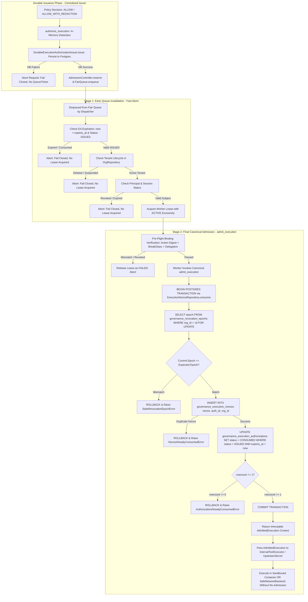

# WhitePact Phase 7A: Execution Security Check Ownership Matrix

**Document Status:** CANONICAL SPECIFICATION PASS 3 (FINAL CALL-PATH & SINGLE-ADMISSION CLOSURE)
**Target Runtime Base SHA:** `13e8de034f8b31bd7cae4f47398f71b24c923c3c` (`ENTERPRISE_AUTH_CANONICAL_SHA` — APPROVED)
**Reconciled Core Ancestor SHA:** `12810825c407960ca2aa9ada94fbae056db37290`
**Current Migration Head:** `0048` (`migrations/versions/0048_enforce_paddle_binding_atomicity.py`)

---

## 1. Architectural Principles

This document defines the strict, single-owner security verification model across the execution lifecycle, eliminating dual-source ambiguity and binding the canonical admission transaction.

### Core Invariants:
1. **Single Canonical Owner:** Every security check has exactly one authoritative owner.
2. **Centralized Durable Issuance Boundary:** `DurableExecutionAuthorizationIssuer` guarantees that no `QueueTicket` can be generated before its `ExecutionAuthorization` is committed in PostgreSQL, across all 3 production call sites (`governance_integration.py` and `upstream_dispatch.py`).
3. **Single Canonical Admission Gate:** `ResponsibleWorker` owns canonical `admit_execution()`, generating a typed `AdmittedExecution` context. Downstream executors (`InternalToolExecutor` and `UpstreamServer`) consume this context and do not re-admit, preventing double admission.
4. **Singular Atomic Admission Transaction:** `ExecutionNonceRepository.consume()` in `src/responsibleai/db/execution_nonce_repository.py` owns the singular PostgreSQL transaction combining the epoch lock, nonce insert, and conditional authorization status update (`ISSUED -> CONSUMED` with `rowcount == 1`).
5. **Derived Expiration & Singular Revocation:** Expiration is derived from `now >= expires_at`. Revocation is owned exclusively by `governance_revocation_epochs`. No dual-source revocation exists.

---

## 2. Security Check Ownership Matrix

| Security Check | Canonical Owner | Queue-Time Check? | Pre-Dispatch Check? | Canonical Durable Check? | Duplication Allowed? | Rationale & Failure Mode |
| :--- | :--- | :--- | :--- | :--- | :--- | :--- |
| **Durable Authorization Issuance** | `DurableExecutionAuthorizationIssuer` (`mcp/governance_integration.py` & `mcp/upstream_dispatch.py`) + `ExecutionAuthRepository` | YES (Persisted prior to enqueue) | NO (Already durable) | YES (Foreign key & primary key constraints) | NO (Sole owner of issuance persistence) | If DB write fails, request fails closed immediately. Queue entry = 0, dispatch = 0. |
| **Canonical Admission Gate** | `ResponsibleWorker` (calls canonical `admit_execution()`) | NO | NO | YES (Combined atomic PG transaction) | NO (Exactly one admission per execution attempt) | Emits immutable `AdmittedExecution` context. Downstream executors (`InternalToolExecutor`, `UpstreamServer`) consume context without re-admission. |
| **Authorization Expiry** | `ExecutionAuthorization.is_expired` | YES (Fast drop) | YES (Pre-flight) | YES (Enforced via `WHERE expires_at > :now` in atomic UPDATE) | YES (Read-only timestamp comparison) | Expiration is derived, never persisted. Early drops prevent queue congestion; final atomic query guard guarantees zero clock-drift execution. |
| **Authorization Consumed State** | `ExecutionNonceRepository.consume()` | YES (Status != ISSUED) | YES (Pre-flight check) | YES (Atomic conditional UPDATE asserting `rowcount == 1`) | NO (Single atomic transition is authoritative) | Conditional update `WHERE status = 'ISSUED' AND expires_at > :now` on same DB connection as nonce insert. If rowcount != 1, transaction rolls back. |
| **Revocation / Governance Epoch** | `governance_revocation_epochs` + `lock_epoch()` | NO (Avoids DB lock) | NO (Avoids unneeded lock) | YES (Sole owner: `admit_execution` via `lock_epoch`) | NO (Must execute under row lock) | Singular authoritative revocation mechanism. Individual `REVOKED` state is eliminated to avoid dual-source ambiguity. |
| **Tenant Binding & Lifecycle** | `OrgRepository` (`organizations`) | YES (Tenant active?) | YES (Pre-flight check) | YES (`ForeignKey` to `organizations.id`) | YES (Fast check avoids lease overhead) | Reject if organization is suspended, deleted, or tombstoned. Commercial billing status (FREE/PRO) is explicitly ignored. |
| **Principal Identity & Status** | `verified_principals` / IAM | YES (Principal exists?) | YES (Pre-flight check) | NO (Evaluated at policy gate & pre-flight) | YES (Read-only check) | If principal was disabled or deleted while queued, reject execution. |
| **Session Binding & Validity** | `iam_sessions` (`SessionService`) | YES (Session unrevoked?) | YES (Pre-flight check) | NO (Evaluated at policy gate & pre-flight) | YES (Read-only check) | If web/SAML session was revoked or expired while queued, reject execution. |
| **Action Binding & Digest Match** | `ExecutionAuthorization.matches_action` | YES (Verify payload) | YES (Pre-flight check) | YES (`_validate_authorization` in `admit_execution`) | YES (Pure cryptographic SHA-256 verification) | Protects against queue tampering. `action_digest == compute_action_digest(action)` verified before and after DB await. |
| **Target Fingerprint Drift** | `check_target_fingerprint()` | NO (Target not resolved) | YES (After target lookup) | YES (In executor prior to transport) | NO (Requires freshly resolved target) | Execution Permit v2: verifies target resolution hasn't drifted between policy evaluation and execution. |
| **Arguments & Redaction Integrity** | Action Digest & `redacted_arguments` | YES (Verify against digest) | YES (Pre-flight check) | YES (Included in `action_digest`) | YES (Deterministic hash match) | Guarantees arguments actually executed match the approved redactions. |
| **Purpose Binding** | `IntentContractRepository` / `governance_approvals` | YES (Purpose matched?) | YES (Pre-flight check) | NO (Validated during policy evaluation) | YES (Read-only string match) | Ensures purpose declared at queue time matches what policy authorized. |
| **Human Approval Resolution** | `ApprovalRepository.consume()` | YES (Status == APPROVED) | YES (Pre-flight check) | YES (Atomic UPDATE in `ApprovalRepository`) | NO (Sole owner of approval spending) | For `REQUIRE_APPROVAL`, `ApprovalRepository.consume()` is the singular linearized authority consumption point. |
| **BreakGlass Authorization** | `iam_break_glass_sessions` (`BreakGlassService`) | YES (Session ACTIVE?) | YES (Session unexpired?) | NO (Status checked in pre-flight) | YES (Read-only query) | If action required emergency BreakGlass, verify session is `ACTIVE` and `expires_at > now`. |
| **Delegation Chain Validity** | `DelegationRepository` | YES (Delegation active?) | YES (Chain unbroken?) | NO (Validated during policy evaluation) | YES (Read-only query) | If executed via delegation, verify delegation record was not revoked. |
| **Consent Proof Validity** | `ConsentProofRepository` | YES (Proof unexpired?) | YES (Scope matched?) | NO (Validated during policy evaluation) | YES (Read-only query) | If executed via user consent, verify consent proof is active and unexpired. |
| **Nonce Replay Prevention** | `governance_execution_nonces` (`ExecutionNonceRepository`) | NO (Do not burn early) | NO (Do not burn early) | YES (Inserted in combined atomic transaction) | NO (Singular canonical admission gate) | Primary key uniqueness on `nonce` guarantees at most one execution across the cluster. |
| **Worker Lease Exclusivity** | `runtime_worker_leases` (`AdmissionLeaseRepository`) | NO | YES (Acquire lease before pre-flight) | YES (Partial unique index on `ACTIVE`) | NO (Sole owner of execution exclusivity) | Enforces that exactly one worker holds active execution rights for an `execution_id`. |

---

## 3. Two-Stage Execution Lifecycle Detail

