# WhitePact Phase 7A: Execution Security Check Ownership Matrix

**Document Status:** CANONICAL SPECIFICATION PASS 4 (SECURITY REMEDIATION)
**Target Runtime Base SHA:** `13e8de034f8b31bd7cae4f47398f71b24c923c3c` (`ENTERPRISE_AUTH_CANONICAL_SHA` — APPROVED)
**Reconciled Core Ancestor SHA:** `12810825c407960ca2aa9ada94fbae056db37290`
**Proposed Migrations:** `0049_runtime_execution_requests.py` through `0052_runtime_worker_leases.py`

---

## 1. Architectural Principles

This document defines the strict, single-owner security verification model across the execution lifecycle, eliminating dual-source ambiguity, establishing one-shot backend execution, and binding the canonical admission transaction.

### Core Invariants:
1. **Single Canonical Owner:** Every security check and state transition has exactly one authoritative owner.
2. **Infrastructure Is Not Authority:** Neither a `QueueTicket`, an active worker lease, a Redis semaphore, nor an in-memory `AdmissionReceipt` constitutes execution authority.
3. **Durable Immutable Execution Request:** Action arguments, purpose, and agent identity are immutably persisted in `runtime_execution_requests` prior to queueing.
4. **Atomic Approval Consumption & Issuance:** Approval consumption and authorization issuance occur in a single PostgreSQL transaction with `UNIQUE(approval_id)`.
5. **Universal Epoch Invalidation:** All 14 authority mutations advance `governance_revocation_epochs.epoch` under a row lock, closing TOCTOU windows.
6. **One-Shot Backend Start Transition:** Possession of an `AdmissionReceipt` is insufficient to execute. Downstream execution requires an atomic transition from `ADMITTED` to `BACKEND_STARTING` in `runtime_execution_attempts` under fence verification.
7. **Monotonic Worker Fencing:** Each lease acquisition increments `lease_generation`. An old worker holding generation N cannot start backend execution if generation N+1 exists or if its lease expired.
8. **Evidence Precedes Lease Finalization:** Backend result -> durable effect/outcome state -> durable evidence/audit write -> mark attempt terminal -> finalize lease -> release capacity.

---

## 2. Security Check Ownership Matrix

| Security Check / State | Canonical Owner | Queue-Time Check? | Pre-Dispatch Check? | Canonical Durable Check? | Duplication Allowed? | Rationale & Failure Mode |
| :--- | :--- | :--- | :--- | :--- | :--- | :--- |
| **Durable Execution Request** | `ExecutionRequestRepository` (`runtime_execution_requests`, Mig 0049) | YES (Persisted before enqueue) | YES (Worker loads from DB) | YES (Append-only table, immutability trigger) | NO (Sole owner of serialized input) | Immutable record of action arguments, purpose, and identity. Replaces unpersisted action passing. |
| **Tenant Idempotency Binding** | `runtime_execution_requests` (`UNIQUE(organization_id, idempotency_key)`) | YES (At API submission) | NO (Already bound) | YES (Database unique constraint) | NO (Sole owner of request deduplication) | Prevents duplicate authorization minting on client retry. Same key + different digest fails closed (HTTP 409). |
| **Human Approval Consumption** | `ApprovalExecutionService` (`governance_approvals`) | YES (Status == APPROVED) | YES (Pre-flight check) | YES (Atomic UPDATE with rowcount == 1 in same TX as auth issuance) | NO (Sole owner of approval spending) | Atomic transition `APPROVED -> CONSUMED`. `UNIQUE(approval_id)` in `governance_execution_authorizations` prevents duplicate issuance. |
| **Authorization Issuance** | `DurableExecutionAuthorizationIssuer` (`governance_execution_authorizations`, Mig 0050) | YES (Committed before enqueue) | NO (Already durable) | YES (Foreign key & primary key constraints) | NO (Sole owner of issuance persistence) | If DB write fails, request fails closed immediately. Queue entry = 0, dispatch = 0. |
| **Revocation / Governance Epoch** | `governance_revocation_epochs` + `lock_epoch()` | NO (Avoids DB lock) | NO (Avoids unneeded lock) | YES (Sole owner: `admit_execution` via `lock_epoch`) | NO (Must execute under row lock) | Singular authoritative revocation mechanism. All 14 authority mutations advance `scope="governance"` epoch. |
| **Authorization Expiry** | `ExecutionAuthorization.is_expired` | YES (Fast drop) | YES (Pre-flight) | YES (Enforced via `WHERE expires_at > :now` in atomic UPDATE) | YES (Read-only timestamp comparison) | Expiration is derived, never persisted. Early drops prevent queue congestion; final atomic query guard guarantees zero clock-drift execution. |
| **Canonical Admission Gate** | `ResponsibleWorker` (calls canonical `admit_execution()`) | NO | NO | YES (Combined atomic PG transaction in `ExecutionNonceRepository.consume()`) | NO (Exactly one admission per execution attempt) | Consumes single-use nonce, updates authorization `ISSUED -> CONSUMED`, emits `AdmissionReceipt`. |
| **Worker Lease & Active Exclusivity** | `runtime_worker_leases` (`AdmissionLeaseRepository`, Mig 0052) | NO | YES (Acquire lease before pre-flight) | YES (Partial unique index on `ACTIVE`) | NO (Sole owner of lease exclusivity) | Enforces that at most one worker holds active execution rights for an `execution_id` at any time. |
| **Monotonic Worker Fencing** | `runtime_worker_leases.lease_generation` (BIGINT) | NO | YES (Acquired with lease) | YES (Verified against active lease row under lock) | NO (Sole owner of worker fencing) | Strictly increasing token. Stale/zombie worker holding generation N fails if generation N+1 exists or lease expired. |
| **Durable Attempt State** | `runtime_execution_attempts` (`state`, Mig 0051) | NO | YES (Attempt initialized LEASED) | YES (Durable state machine: PENDING, LEASED, ADMITTED, BACKEND_STARTING, etc.) | NO (Sole owner of attempt lifecycle) | Tracks progress through admission, backend start, and terminal completion. |
| **One-Shot Backend-Start Transition** | `runtime_execution_attempts` (atomic update) | NO | NO | YES (Atomic UPDATE: `ADMITTED -> BACKEND_STARTING` with `rowcount == 1`) | NO (Sole owner of backend-start ownership) | Possession of `AdmissionReceipt` is insufficient. Atomic DB transition must succeed before invoking container or network. |
| **Target Fingerprint Drift** | `check_target_fingerprint()` | NO (Target not resolved) | YES (After target lookup) | YES (In `UpstreamMCPExecutor` prior to transport) | NO (Requires freshly resolved target) | Execution Permit v2: verifies target resolution hasn't drifted between policy evaluation and execution. |
| **SafeNetwork Validation** | `SafeNetworkBackend` | NO | NO | YES (Immediate pre-socket bind) | NO (Sole owner of network egress) | Enforces SSRF protection, IP pinning, redirect validation, and private address rejection. |
| **Container Isolation** | `ContainerIsolationBackend` | NO | NO | YES (Docker flags `--network=none`, limits) | NO (Sole owner of compute containment) | Enforces CPU 0.5, RAM 256MB, PID 32, workspace 10MB/100 files bounds. |
| **Durable Effect State** | `runtime_execution_attempts.effect_state` | NO | NO | YES (`NO_EFFECT`, `EFFECT_TRANSMITTING`, `EFFECT_CONFIRMED`, `EFFECT_UNCERTAIN`) | NO (Sole owner of effect status) | Records whether side effects began. Prohibits automatic replay from `EFFECT_TRANSMITTING` or `UNCERTAIN`. |
| **Durable Evidence & Audit** | `EvidenceRepository` / `AuditLedger` | NO | NO | YES (Committed before lease finalization) | NO (Sole owner of compliance evidence) | Evidence is written before attempt completion. If evidence write fails after confirmed effect, marks `INCOMPLETE` without re-running effect. |
| **Capacity Reservation** | `AdmissionController` (Redis + DB Reconciler) | YES (Reserve at enqueue) | NO | YES (Audit reconciler syncs active attempts/leases) | NO (Sole owner of cluster concurrency) | Redis failure fails closed (reduces availability, never weakens security). Worker crash cannot permanently leak capacity. |

---

## 3. Two-Stage Execution Lifecycle & Backend-Start Detail

```mermaid
flowchart TD
    subgraph ISSUANCE [Durable Issuance Phase - Single Transaction]
        REQ[Client ActionRequest with idempotency_key] --> CHECK_IDEMP{Existing Request?}
        CHECK_IDEMP -- Same Key + Same Digest --> RETURN_EXISTING[Return Existing Execution ID]
        CHECK_IDEMP -- Same Key + Diff Digest --> CONFLICT[HTTP 409 Conflict]
        CHECK_IDEMP -- New Key / No Key --> POL[Evaluate Governance Policy]
        POL -- ALLOW / REDACT --> TX_ISSUE[BEGIN POSTGRES TRANSACTION]
        TX_ISSUE --> INS_REQ[INSERT runtime_execution_requests]
        TX_ISSUE --> APP_CHECK{Approval Required?}
        APP_CHECK -- Yes --> CONSUME_APP[UPDATE governance_approvals SET status=CONSUMED]
        APP_CHECK -- No --> INS_AUTH[INSERT governance_execution_authorizations UNIQUE approval_id]
        CONSUME_APP --> INS_AUTH
        INS_AUTH --> INS_ATTEMPT[INSERT runtime_execution_attempts state=PENDING]
        INS_ATTEMPT --> COMMIT_ISSUE[COMMIT TRANSACTION]
        COMMIT_ISSUE --> ENQUEUE[AdmissionController.reserve & FairQueue.enqueue]
    end

    subgraph STAGE1 [Stage 1: Early Invalidation & Lease Acquisition]
        ENQUEUE --> DEQUEUE[Dequeued from Fair Queue by Dispatcher]
        DEQUEUE --> C1[Check Expiration: now < expires_at & Status: ISSUED]
        C1 -- Invalid --> DROP1[Abort: Fail Closed, No Lease]
        C1 -- Valid --> LEASE[Acquire Worker Lease with Monotonic Generation N]
    end

    subgraph STAGE2 [Stage 2: Canonical Admission - admit_execution]
        LEASE --> PREFLIGHT[Pre-Flight Checks: Digest Match, BreakGlass, Delegation]
        PREFLIGHT -- Failed --> ABORT_LEASE[Mark Lease FAILED, Abort]
        PREFLIGHT -- Passed --> ADMIT[Worker Invokes Canonical admit_execution]
        ADMIT --> TX_ADMIT[BEGIN POSTGRES TRANSACTION]
        TX_ADMIT --> LOCK_EPOCH[SELECT epoch FROM governance_revocation_epochs FOR UPDATE]
        LOCK_EPOCH --> VERIFY_EPOCH{Current Epoch == Expected Epoch?}
        VERIFY_EPOCH -- Mismatch --> ROLLBACK1[ROLLBACK & Raise StaleRevocationEpochError]
        VERIFY_EPOCH -- Match --> INSERT_NONCE[INSERT governance_execution_nonces]
        INSERT_NONCE -- Success --> UPDATE_AUTH[UPDATE governance_execution_authorizations SET status=CONSUMED]
        UPDATE_AUTH --> COMMIT_ADMIT[COMMIT TRANSACTION]
        COMMIT_ADMIT --> RECEIPT[Emit In-Process AdmissionReceipt]
    end

    subgraph STAGE3 [Stage 3: One-Shot Backend Start & Execution]
        RECEIPT --> TX_START[BEGIN POSTGRES TRANSACTION]
        TX_START --> LOCK_LEASE[SELECT lease_generation FROM runtime_worker_leases WHERE status=ACTIVE FOR UPDATE]
        LOCK_LEASE --> VERIFY_FENCE{Lease Active & Generation == N?}
        VERIFY_FENCE -- No / Stale Worker --> ROLLBACK2[ROLLBACK & Raise ZombieWorkerFencedError]
        VERIFY_FENCE -- Yes --> UPDATE_START[UPDATE runtime_execution_attempts SET state=BACKEND_STARTING WHERE state=ADMITTED]
        UPDATE_START --> CHECK_START{rowcount == 1?}
        CHECK_START -- 0 / Already Started --> ROLLBACK3[ROLLBACK & Raise BackendStartOwnershipLostError]
        CHECK_START -- 1 --> COMMIT_START[COMMIT TRANSACTION]
        COMMIT_START --> BACKEND[Invoke ContainerIsolationBackend OR UpstreamMCPExecutor]
        BACKEND --> RESULT[Capture Result]
        RESULT --> EV_WRITE[Durable Evidence Write]
        EV_WRITE --> TERM_ATTEMPT[Mark Attempt COMPLETED / FAILED]
        TERM_ATTEMPT --> FIN_LEASE[Finalize Worker Lease COMPLETED]
        FIN_LEASE --> REL_CAP[Release Capacity Reservation]
    end
```

