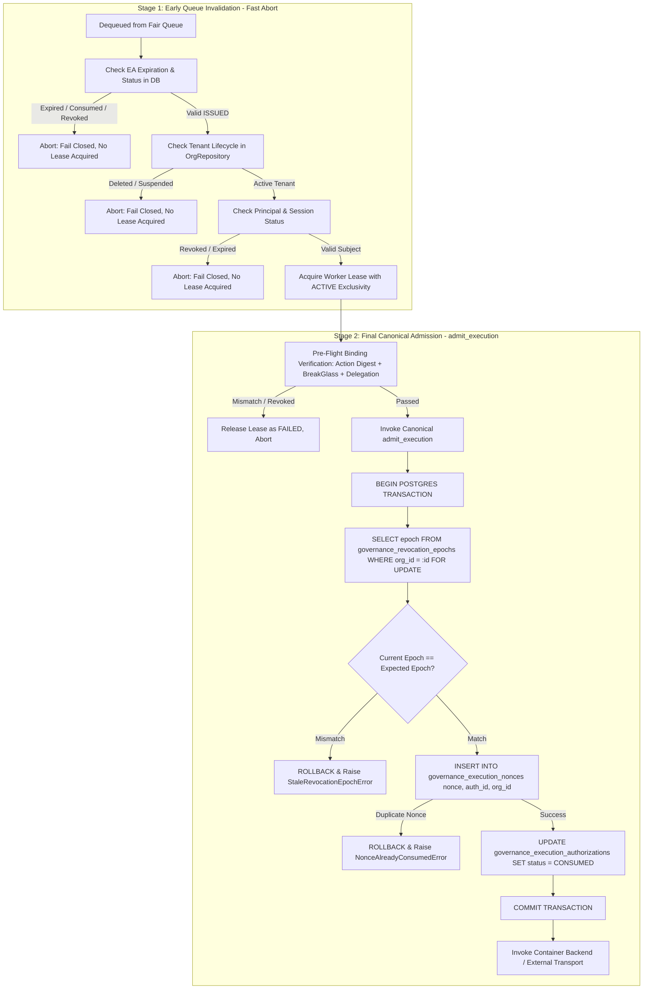

# WhitePact Phase 7A: Execution Security Check Ownership Matrix

**Document Status:** CANONICAL SPECIFICATION PASS 2 (POST-CODEX REVIEW REMEDIATION)
**Target Runtime Base SHA:** `13e8de034f8b31bd7cae4f47398f71b24c923c3c` (`ENTERPRISE_AUTH_CANONICAL_SHA` — APPROVED)
**Reconciled Core Ancestor SHA:** `12810825c407960ca2aa9ada94fbae056db37290`
**Current Migration Head:** `0048` (`migrations/versions/0048_enforce_paddle_binding_atomicity.py`)

---

## 1. Architectural Principles

This document resolves Codex review findings **P0-2** and **P1-1** by defining a strict, non-redundant, single-owner security verification model across the entire execution lifecycle.

### Core Invariants:
1. **Single Canonical Owner:** Every security check has exactly one authoritative owner that enforces that check.
2. **Two-Stage Validation Separation:**
   - **Stage 1 (Early Queue Invalidation):** Evaluated by the Worker Dispatcher upon dequeuing a ticket. Purpose: fast abort without consuming capacity, acquiring worker leases, or locking DB rows.
   - **Stage 2 (Final Canonical Admission):** Evaluated atomically by `admit_execution()` in `src/responsibleai/governance/execution.py` immediately before tool invocation. Purpose: non-bypassable, linearized, durable gatekeeper.
3. **No Redundant / Desynchronized Logic:** Pre-flight checks do not attempt to duplicate the atomic row locking and nonce consumption performed by `admit_execution()`.

---

## 2. Security Check Ownership Matrix

| Security Check | Canonical Owner | Queue-Time Check? | Pre-Dispatch Check? | Canonical Durable Check? | Duplication Allowed? | Rationale & Failure Mode |
| :--- | :--- | :--- | :--- | :--- | :--- | :--- |
| **Authorization Expiry** | `ExecutionAuthorization.is_expired` | YES (Fast drop) | YES (Pre-flight) | YES (`admit_execution`) | YES (Read-only timestamp comparison) | If `now >= expires_at`, permit is dead. Fast-drops reduce queue latency; final check in `admit_execution()` prevents clock drift / race. |
| **Authorization Consumed State** | `ExecutionAuthorizationRepository` | YES (Status != ISSUED) | YES (DB check) | YES (Atomic UPDATE in `admit_execution`) | NO (Final atomic transition is authoritative) | Early check drops already-spent permits. Atomic `UPDATE ... WHERE status = 'ISSUED'` prevents concurrent double-consumption. |
| **Authorization Revocation** | `ExecutionAuthorizationRepository` | YES (Status == REVOKED) | YES (DB check) | YES (`admit_execution` via epoch) | NO (Linearized by epoch) | Manual or incident revocation flips DB status to `REVOKED`. Drops immediately. |
| **Revocation / Governance Epoch** | `governance_revocation_epochs` + `lock_epoch()` | NO (Avoids DB lock) | NO (Avoids unneeded lock) | YES (Sole owner: `admit_execution`) | NO (Must execute under row lock) | Checking epoch outside `lock_epoch()` creates a race condition. Checked exclusively inside `nonce_repo.consume()`. |
| **Tenant Binding & Lifecycle** | `OrgRepository` (`organizations`) | YES (Tenant active?) | YES (Pre-flight check) | YES (`ForeignKey` to `organizations.id`) | YES (Fast check avoids lease overhead) | Reject if organization is suspended, deleted, or tombstoned. Commercial billing status (FREE/PRO) is explicitly ignored. |
| **Principal Identity & Status** | `verified_principals` / IAM | YES (Principal exists?) | YES (Pre-flight check) | NO (Evaluated at policy gate & pre-flight) | YES (Read-only check) | If principal was disabled or deleted while queued, reject execution. |
| **Session Binding & Validity** | `iam_sessions` (`SessionService`) | YES (Session unrevoked?) | YES (Pre-flight check) | NO (Evaluated at policy gate & pre-flight) | YES (Read-only check) | If web/SAML session was revoked or expired while queued, reject execution. |
| **Action Binding & Digest Match** | `ExecutionAuthorization.matches_action` | YES (Verify payload) | YES (Pre-flight check) | YES (`_validate_authorization` in `admit_execution`) | YES (Pure cryptographic SHA-256 verification) | Protects against queue tampering. `action_digest == compute_action_digest(action)` verified before and after DB await. |
| **Target Fingerprint Drift** | `check_target_fingerprint()` | NO (Target not resolved) | YES (After target lookup) | YES (In executor prior to transport) | NO (Requires freshly resolved target) | Execution Permit v2: verifies target resolution hasn't drifted between policy evaluation and execution. |
| **Arguments & Redaction Integrity** | Action Digest & `redacted_arguments` | YES (Verify against digest) | YES (Pre-flight check) | YES (Included in `action_digest`) | YES (Deterministic hash match) | Guarantees arguments actually executed match the approved redactions. |
| **Purpose Binding** | `IntentContractRepository` / `governance_approvals` | YES (Purpose matched?) | YES (Pre-flight check) | NO (Validated during policy evaluation) | YES (Read-only string match) | Ensures purpose declared at queue time matches what policy authorized. |
| **Human Approval Resolution** | `ApprovalRepository.consume()` | YES (Status == APPROVED) | YES (Pre-flight check) | YES (Atomic UPDATE in `ApprovalRepository`) | NO (Sole owner of approval spending) | For `REQUIRE_APPROVAL`, `ApprovalRepository.consume()` is the singular linearized authority consumption point. |
| **BreakGlass Authorization** | `iam_break_glass_sessions` (`BreakGlassService`) | YES (Session ACTIVE?) | YES (Session unexpired?) | NO (Status checked in pre-flight) | YES (Read-only query) | If action required emergency BreakGlass, verify session is `ACTIVE` and `expires_at > now`. |
| **Delegation Chain Validity** | `DelegationRepository` | YES (Delegation active?) | YES (Chain unbroken?) | NO (Validated during policy evaluation) | YES (Read-only query) | If executed via delegation, verify delegation record was not revoked. |
| **Consent Proof Validity** | `ConsentProofRepository` | YES (Proof unexpired?) | YES (Scope matched?) | NO (Validated during policy evaluation) | YES (Read-only query) | If executed via user consent, verify consent proof is active and unexpired. |
| **Nonce Replay Prevention** | `governance_execution_nonces` (`ExecutionNonceRepository`) | NO (Do not burn early) | NO (Do not burn early) | YES (Sole owner: `admit_execution`) | NO (Singular canonical admission gate) | Primary key uniqueness on `nonce` guarantees at most one execution across the cluster. |
| **Worker Lease Exclusivity** | `runtime_worker_leases` (`AdmissionLeaseRepository`) | NO | YES (Acquire lease before pre-flight) | YES (Partial unique index on `ACTIVE`) | NO (Sole owner of execution exclusivity) | Enforces that exactly one worker holds active execution rights for an `execution_id`. |

---

## 3. Two-Stage Execution Lifecycle Detail

---

## 4. Invariant Protection Summary

1. **Queue substitution attack is IMPOSSIBLE:**
   The worker re-computes `compute_action_digest(action)` from the dequeued action payload and compares it against `authorization.action_digest` loaded directly from `governance_execution_authorizations`. Any mutation in arguments, action type, or target immediately fails validation.
2. **Double consumption is IMPOSSIBLE:**
   Even if two workers simultaneously dequeue the same execution item, one of two barriers will stop the second worker:
   - **Barrier 1 (Worker Lease):** Database partial unique index on `runtime_worker_leases (execution_id) WHERE status = 'ACTIVE'` prevents two workers from holding an active lease concurrently.
   - **Barrier 2 (Canonical Admission):** Primary key constraint on `governance_execution_nonces (nonce)` inside `admit_execution()` guarantees that only one transaction can commit.
3. **Revocation race is IMPOSSIBLE:**
   `lock_epoch()` serializes the admission attempt against any concurrent epoch bump (e.g. policy change or key rotation). If the epoch was bumped while the request waited in queue, admission fails closed immediately.
