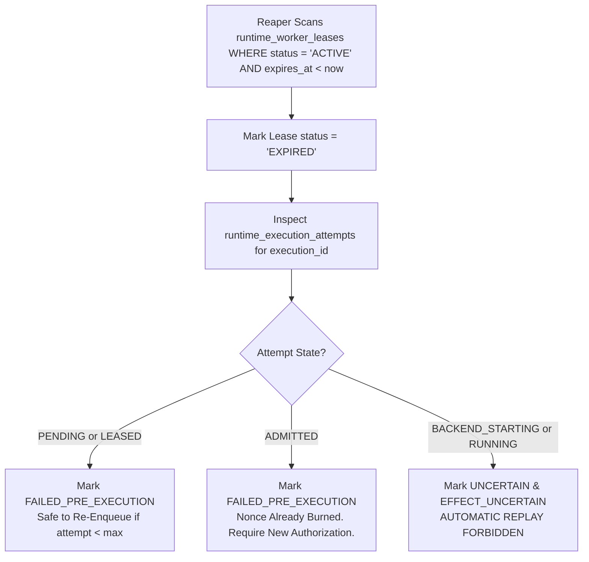

# WhitePact Phase 7A: Worker Fencing, Lease Generation & Crash Recovery

**Document Status:** CANONICAL SPECIFICATION PASS 4 (SECURITY REMEDIATION)
**Target Runtime Base SHA:** `13e8de034f8b31bd7cae4f47398f71b24c923c3c` (`ENTERPRISE_AUTH_CANONICAL_SHA` — APPROVED)
**Reconciled Core Ancestor SHA:** `12810825c407960ca2aa9ada94fbae056db37290`
**Proposed Migration:** `0052_runtime_worker_leases.py` (down-revision: `0051`)

---

## 1. Problem Statement & Threat Model

Distributed worker architectures face the split-brain / zombie worker vulnerability:
1. **Network Partition / Deep GC Pause:** Worker 1 acquires an execution lease. Due to a network pause or thread stall, Worker 1 fails to heartbeat.
2. **Lease Expiry & Reassignment:** The supervisor declares Worker 1 dead and assigns the execution to Worker 2.
3. **Resumption of Zombie Worker:** Worker 1 awakens and executes the side-effect (launching a container or making an external HTTP call), while Worker 2 simultaneously executes the same side-effect.
4. **Failure of `UNIQUE WHERE status = 'ACTIVE'`:** A simple active unique index prevents two active database rows at the exact same millisecond, but it does NOT stop Worker 1 if Worker 1 already read the database earlier and proceeds to execute against local Docker or network sockets.

To eliminate this vulnerability, WhitePact enforces **Monotonic Worker Fencing** directly inside PostgreSQL.

---

## 2. Table Schema: `runtime_worker_leases`

Migration `0052_runtime_worker_leases.py` introduces monotonic lease generations and fencing tokens:

```sql
CREATE TABLE runtime_worker_leases (
    lease_id VARCHAR(64) PRIMARY KEY,
    execution_id VARCHAR(64) NOT NULL,
    attempt_id VARCHAR(64) NOT NULL,
    organization_id VARCHAR(64) NOT NULL,
    worker_id VARCHAR(64) NOT NULL,
    lease_generation BIGINT NOT NULL,
    status VARCHAR(32) NOT NULL DEFAULT 'ACTIVE',
    acquired_at TIMESTAMPTZ NOT NULL DEFAULT CURRENT_TIMESTAMP,
    heartbeat_at TIMESTAMPTZ NOT NULL DEFAULT CURRENT_TIMESTAMP,
    expires_at TIMESTAMPTZ NOT NULL,
    released_at TIMESTAMPTZ NULL,

    CONSTRAINT fk_lease_exec
        FOREIGN KEY (execution_id)
        REFERENCES runtime_execution_requests(execution_id)
        ON DELETE RESTRICT,

    CONSTRAINT fk_lease_attempt
        FOREIGN KEY (attempt_id)
        REFERENCES runtime_execution_attempts(attempt_id)
        ON DELETE RESTRICT,

    CONSTRAINT fk_lease_org
        FOREIGN KEY (organization_id)
        REFERENCES organizations(id)
        ON DELETE RESTRICT,

    CONSTRAINT chk_lease_status
        CHECK (status IN ('ACTIVE', 'COMPLETED', 'EXPIRED', 'REVOKED', 'FAILED'))
);

-- Exactly one active lease per execution across the entire cluster
CREATE UNIQUE INDEX idx_runtime_worker_leases_active_execution
ON runtime_worker_leases (execution_id)
WHERE status = 'ACTIVE';

-- Monotonic lease generation uniqueness per execution
CREATE UNIQUE INDEX idx_runtime_worker_leases_generation
ON runtime_worker_leases (execution_id, lease_generation);

-- Efficient heartbeat reaper index
CREATE INDEX idx_runtime_worker_leases_reaper
ON runtime_worker_leases (status, expires_at)
WHERE status = 'ACTIVE';
```

---

## 3. Monotonic Fencing Protocol

### 3.1 Strict Generation Increment
Every time a lease is created or reassigned for an `execution_id`, the system computes the next generation monotonically:
```sql
SELECT COALESCE(MAX(lease_generation), 0) + 1
FROM runtime_worker_leases
WHERE execution_id = :execution_id;
```
Worker 1 receives Generation 1. If Worker 1 stalls and a replacement worker is leased, Worker 2 receives Generation 2.

### 3.2 Atomic Pre-Start Fencing Check
Immediately before starting the backend, Worker 1 must atomically prove its lease generation is still the authoritative generation in PostgreSQL:

```sql
BEGIN TRANSACTION;

-- 1. Lock the active lease row
SELECT lease_generation, worker_id, status
FROM runtime_worker_leases
WHERE execution_id = :execution_id AND status = 'ACTIVE'
FOR UPDATE;

-- 2. Validate lease belongs to this worker and generation matches
-- If generation != :my_generation OR worker_id != :my_worker_id:
--    ROLLBACK and raise ZombieWorkerFencedError

-- 3. Execute one-shot backend-start transition
UPDATE runtime_execution_attempts
SET state = 'BACKEND_STARTING',
    backend_started_at = CURRENT_TIMESTAMP,
    updated_at = CURRENT_TIMESTAMP
WHERE execution_id = :execution_id
  AND attempt_id = :attempt_id
  AND lease_generation = :my_generation
  AND state = 'ADMITTED';

-- If rowcount != 1:
--    ROLLBACK and raise BackendStartOwnershipLostError

COMMIT;
```

### 3.3 Zombie Worker Exclusion
If Worker 1 awakens after Worker 2 has acquired Generation 2:
- Worker 1's lock query reveals that the active lease generation is 2 (or that Worker 1's lease is `EXPIRED`).
- Worker 1's atomic update matches `rowcount == 0`.
- Worker 1's transaction rolls back and execution halts immediately.
- **Worker 1 never invokes Docker or transmits an HTTP packet.**

---

## 4. Stale Lease Reaper & Crash Recovery Rules

The background `WorkerSupervisor` runs periodically (every 5 seconds) to detect dead workers:



### Recovery Matrix Rules:
1. **Pre-Admission Death (`PENDING`, `LEASED`):**
   - Zero side-effects began.
   - Nonce was NOT consumed.
   - Supervisor marks attempt `FAILED_PRE_EXECUTION` and releases capacity.
   - Safe to re-enqueue.
2. **Post-Admission / Pre-Backend Death (`ADMITTED`):**
   - Canonical admission succeeded and nonce was committed to PostgreSQL.
   - However, `BACKEND_STARTING` was never reached (guaranteed `NO_EFFECT`).
   - Because the single-use nonce is burned, the ticket CANNOT be re-run directly.
   - Attempt is marked `FAILED_PRE_EXECUTION` with failure code `ADMISSION_EXPIRED_PRE_EXECUTION`.
   - Client must re-issue an `ActionRequest`.
3. **In-Flight Death (`BACKEND_STARTING`, `RUNNING`):**
   - Container was launched or HTTP request was transmitted.
   - Outcome is unknown.
   - Attempt is marked `UNCERTAIN` and `effect_state = 'EFFECT_UNCERTAIN'`.
   - **Automatic retry is strictly prohibited.**
   - Upstream reconciliation is triggered via `effect_id`. If reconciliation cannot prove absence of effect, the task remains terminal pending human administrator review.
