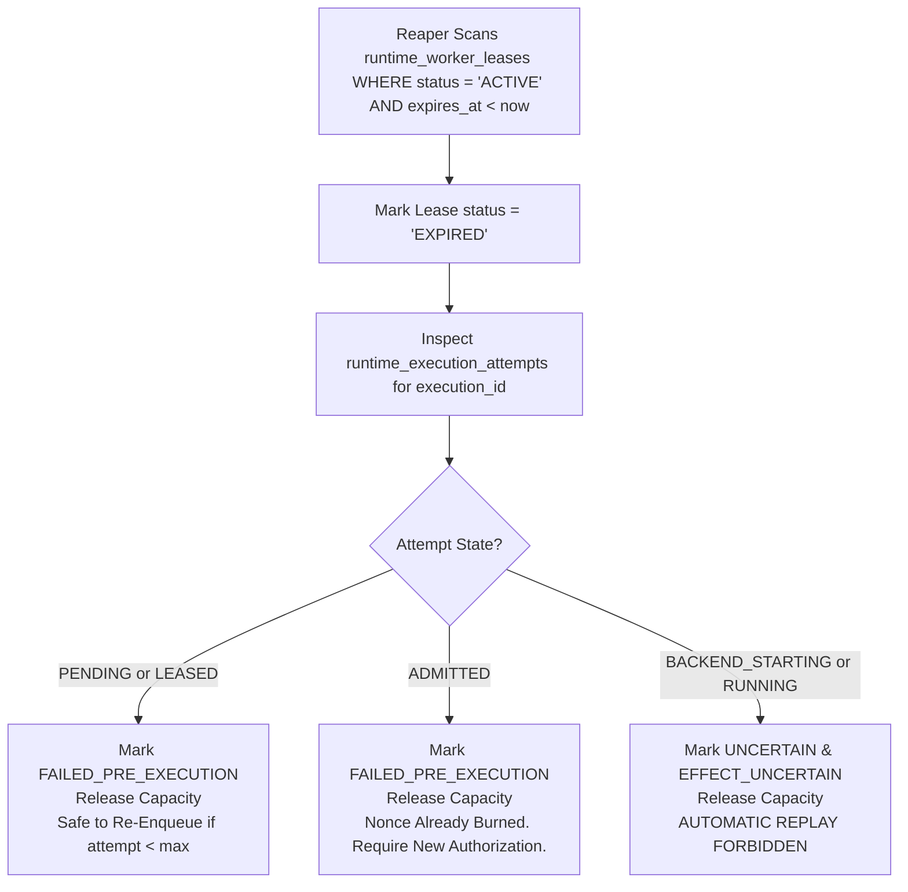

# WhitePact Phase 7A: Worker Fencing, Lease Generation & Crash Recovery

**Document Status:** CANONICAL SPECIFICATION PASS 4.3 (SECURITY BOUNDARY CLOSURE)
**Target Runtime Base SHA:** `13e8de034f8b31bd7cae4f47398f71b24c923c3c` (`ENTERPRISE_AUTH_CANONICAL_SHA` — APPROVED)
**Reconciled Core Ancestor SHA:** `12810825c407960ca2aa9ada94fbae056db37290`
**Proposed Migration:** `0053_runtime_worker_leases.py` (down-revision: `0052`)

**Canonical migration ownership:** `docs/phase7a-execution/migration-ownership.md` (implemented `0049` = org governance lifecycle).

---

## 1. Problem Statement & Threat Model

Distributed worker architectures face the split-brain / zombie worker vulnerability:
1. **Network Partition / Deep GC Pause:** Worker 1 acquires an execution lease. Due to a network pause or thread stall, Worker 1 fails to heartbeat.
2. **Lease Expiry & Reassignment:** The supervisor declares Worker 1 dead and assigns the execution to Worker 2.
3. **Resumption of Zombie Worker:** Worker 1 awakens and executes the side-effect (launching a container or making an external HTTP call), while Worker 2 simultaneously executes the same side-effect.
4. **Failure of Incomplete Fencing:** An in-memory active lease flag or non-atomic generation computation (`SELECT MAX + 1`) permits concurrent workers to compute identical generations or execute with expired leases before the supervisor reaper runs.

To eliminate this vulnerability, WhitePact enforces:
- **Dedicated Atomic Generation Counter:** Monotonically increasing generations allocated via `runtime_execution_fences`.
- **Synchronous Expiry Fencing:** Backend start verifies lease status, worker identity, generation, and `expires_at > CURRENT_TIMESTAMP` under row lock.
- **Reaper-Independent Correctness:** Stale workers fail closed immediately, regardless of background reaper timing.

---

## 2. Table Schemas: `runtime_execution_fences` and `runtime_worker_leases`

Migration `0053_runtime_worker_leases.py` establishes the dedicated fence counters and worker leases:

```sql
-- Dedicated execution fence counter table (4.1-F04)
CREATE TABLE runtime_execution_fences (
    execution_id VARCHAR(64) PRIMARY KEY,
    current_generation BIGINT NOT NULL DEFAULT 0,
    created_at TIMESTAMPTZ NOT NULL DEFAULT CURRENT_TIMESTAMP,

    CONSTRAINT fk_fence_exec_req
        FOREIGN KEY (execution_id)
        REFERENCES runtime_execution_requests(execution_id)
        ON DELETE RESTRICT
);

-- Worker lease table
CREATE TABLE runtime_worker_leases (
    lease_id VARCHAR(64) PRIMARY KEY,
    execution_id VARCHAR(64) NOT NULL,
    attempt_id VARCHAR(64) NOT NULL,
    organization_id VARCHAR(64) NOT NULL,
    worker_id VARCHAR(64) NOT NULL,
    lease_generation BIGINT NOT NULL,
    status VARCHAR(32) NOT NULL DEFAULT 'ACTIVE',
    acquired_at TIMESTAMPTZ NOT NULL DEFAULT CURRENT_TIMESTAMP,
    heartbeat_at TIMESTAMPTZ NOT NULL DEFAULT CURRENT_TIMESTAMP,
    expires_at TIMESTAMPTZ NOT NULL,
    released_at TIMESTAMPTZ NULL,

    CONSTRAINT fk_lease_exec
        FOREIGN KEY (execution_id)
        REFERENCES runtime_execution_requests(execution_id)
        ON DELETE RESTRICT,

    CONSTRAINT fk_lease_attempt
        FOREIGN KEY (attempt_id)
        REFERENCES runtime_execution_attempts(attempt_id)
        ON DELETE RESTRICT,

    CONSTRAINT fk_lease_org
        FOREIGN KEY (organization_id)
        REFERENCES organizations(id)
        ON DELETE RESTRICT,

    CONSTRAINT chk_lease_status
        CHECK (status IN ('ACTIVE', 'COMPLETED', 'EXPIRED', 'REVOKED', 'FAILED'))
);

-- Exactly one active lease per execution across the entire cluster
CREATE UNIQUE INDEX idx_runtime_worker_leases_active_execution
ON runtime_worker_leases (execution_id)
WHERE status = 'ACTIVE';

-- Monotonic lease generation uniqueness per execution
CREATE UNIQUE INDEX idx_runtime_worker_leases_generation
ON runtime_worker_leases (execution_id, lease_generation);

-- Efficient heartbeat reaper index
CREATE INDEX idx_runtime_worker_leases_reaper
ON runtime_worker_leases (status, expires_at)
WHERE status = 'ACTIVE';
```

---

## 3. Atomic Monotonic Lease Generation Allocation (4.1-F04)

During centralized issuance, a fence row is created with `current_generation = 0`.

When a worker acquires an initial lease or reassigns an execution, it allocates the next generation atomically:

```sql
UPDATE runtime_execution_fences
SET current_generation = current_generation + 1
WHERE execution_id = :execution_id
RETURNING current_generation;
```

### Invariants:
1. **Strict Monotonicity:** Generations are strictly increasing integers: 1, 2, 3...
2. **Zero Concurrency Race:** Row-level locking inside PostgreSQL ensures concurrent lease acquisition attempts never compute or allocate identical generation numbers.
3. **Auditability:** `runtime_execution_fences` records the exact total generation counter for every execution.

---

## 4. Synchronous Fencing Verification at Backend-Start & Final Pre-Effect CAS (F4.3-01, F4.3-02)

### 4.1 Stage 3: `claim_backend_start()`
Worker transitions `ADMITTED -> BACKEND_STARTING` under row lock and generates a single-use secret token:

```sql
BEGIN TRANSACTION;

-- 1. Lock and synchronously verify active, unexpired lease
SELECT lease_generation, worker_id, lease_id, expires_at
FROM runtime_worker_leases
WHERE execution_id = :execution_id
  AND attempt_id = :attempt_id
  AND lease_id = :lease_id
  AND worker_id = :worker_id
  AND lease_generation = :lease_generation
  AND status = 'ACTIVE'
  AND expires_at > CURRENT_TIMESTAMP
FOR UPDATE;

-- 2. Execute one-shot backend-start transition with token hash
UPDATE runtime_execution_attempts
SET state = 'BACKEND_STARTING',
    effect_state = 'EFFECT_STARTING',
    backend_start_token_hash = :token_hash,
    backend_started_at = CURRENT_TIMESTAMP,
    updated_at = CURRENT_TIMESTAMP
WHERE attempt_id = :attempt_id
  AND execution_id = :execution_id
  AND authorization_id = :authorization_id
  AND worker_id = :worker_id
  AND lease_id = :lease_id
  AND lease_generation = :my_generation
  AND state = 'ADMITTED';
-- Assert rowcount == 1 (Rollback if 0)

COMMIT;
```

### 4.2 Stage 4: Synchronous Lease Revalidation at Final Pre-Effect CAS (F4.3-01)
Time can pass between `claim_backend_start()` and side-effect execution (e.g., thread pause, GC stall). Therefore, executors execute an atomic PostgreSQL transaction immediately prior to container execution or socket byte transmission:

```sql
BEGIN TRANSACTION;

-- 1. Synchronously revalidate and lock CURRENT active, unexpired lease (F4.3-01)
SELECT lease_id, worker_id, lease_generation, status, expires_at
FROM runtime_worker_leases
WHERE execution_id = :execution_id
  AND attempt_id = :attempt_id
  AND lease_id = :lease_id
  AND worker_id = :worker_id
  AND lease_generation = :lease_generation
  AND status = 'ACTIVE'
  AND expires_at > CURRENT_TIMESTAMP
FOR UPDATE;
-- Require exactly 1 row; rollback and fail closed if 0.

-- 2. Verify immutable durable request action_digest (and target_fingerprint for external) (F4.3-02, F4.3-03)
SELECT action_digest, target_fingerprint
FROM runtime_execution_requests
WHERE execution_id = :execution_id
  AND organization_id = :organization_id;
-- Assert match; rollback if mismatch.

-- 3. Atomic one-shot attempt transition consuming token (F4.3-01, F4.3-02)
UPDATE runtime_execution_attempts
SET state = 'RUNNING',
    backend_start_token_hash = NULL, -- Token consumed / invalidated
    updated_at = CURRENT_TIMESTAMP
WHERE attempt_id = :attempt_id
  AND execution_id = :execution_id
  AND authorization_id = :authorization_id
  AND organization_id = :organization_id
  AND worker_id = :worker_id
  AND lease_id = :lease_id
  AND lease_generation = :lease_generation
  AND effect_id = :effect_id
  AND state = 'BACKEND_STARTING'
  AND effect_state = 'EFFECT_STARTING'
  AND backend_start_token_hash = :expected_token_hash;
-- Require rowcount == 1; rollback if 0.

COMMIT;
```

### Independence from Background Reaper:
The condition `expires_at > CURRENT_TIMESTAMP` is checked **synchronously** inside the lock at both `claim_backend_start()` AND the final pre-effect CAS. If a worker's lease expired 10 milliseconds ago or generation was replaced during a GC stall, the check fails immediately, even if the background reaper has not yet run. **Correctness never relies on background reaper timing, and zombie workers are strictly prevented from executing side effects.**

---

## 5. Stale Lease Reaper & Capacity Recovery Rules (4.1-F13)

The background `WorkerSupervisor` runs periodically (every 5 seconds) to clean up stale resources and reconcile capacity:



### Comprehensive Capacity Release Matrix (4.1-F13):
Every capacity reservation made at enqueue time (`AdmissionController.reserve_execution`) MUST terminate in an explicit release:
1. **Queue Rejection / Timeout:** Capacity released immediately by AdmissionController / Queue.
2. **Early Queue Invalidation:** Dispatcher drops ticket -> calls `AdmissionController.release_execution()`.
3. **Lease Acquisition Failure:** Attempt remains `PENDING` or marked `FAILED_PRE_EXECUTION` -> capacity released.
4. **Preflight / Admission Failure:** Lease marked `FAILED`, attempt marked `FAILED_PRE_EXECUTION` -> capacity released.
5. **Backend Start Claim Failure:** Attempt fails to transition -> lease released -> capacity released.
6. **Normal Execution Completion (`COMPLETED`, `FAILED`):** Evidence written -> lease `COMPLETED` -> capacity released.
7. **Disrupted / Ambiguous Execution (`UNCERTAIN`):** Attempt marked `UNCERTAIN` -> lease `EXPIRED` -> capacity released.
8. **Worker / Node Crash:** Supervisor reconciler inspects active Redis capacity reservations against active PostgreSQL leases and releases orphaned reservations.
