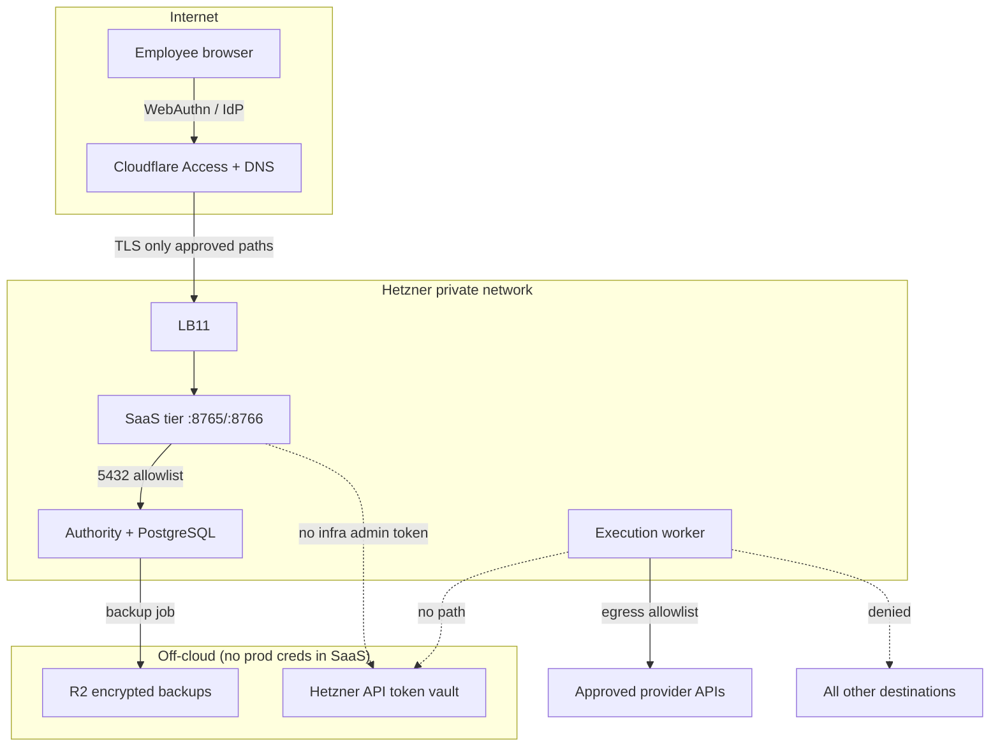

# WhitePact Cloud — Private Staging Architecture

| Field | Value |
|-------|--------|
| Repository SHA (baseline) | `caf539bcaa9893d346ce01f6fbc032cf9d1eabc4` |
| PR | [#128](https://github.com/Guruprasath-Annadurai/Whitepact/pull/128) |
| Environment name | `staging-private` (disposable) |

## Control status legend

| Tag | Meaning |
|-----|---------|
| **IMPLEMENTED** | Code or IaC exists in repo |
| **VERIFIED_AUTOMATED_TESTS** | CI/pytest evidence on SHA above |
| **VERIFIED_SIMULATION** | `terraform validate`, template/unit tests only |
| **AWAITING_LIVE_STAGING** | Requires owner-approved apply |
| **BLOCKED_PROVIDER_ACCESS** | No live API token / DNS |
| **OWNER_APPROVAL_REQUIRED** | Spend or credential action |

## Trust doctrine

Agents may plan freely but cannot act outside independently enforced authority. Staging must prove that boundary on the network, in PostgreSQL grant state, and at the privileged executor — not only in unit tests.

## Minimum defensible staging topology

Staging is **smaller than production** but must exercise the same trust boundaries: identity → policy → grant → verification → (disabled-by-default) executor → provider API.

### Bill of materials (minimum)

| # | Resource | Provider | Role | Prod-shaped? | Status |
|---|----------|----------|------|--------------|--------|
| 1 | 1× CX22 | Hetzner | Combined SaaS + app (staging collapse) | No (dev-minimum) | **VERIFIED_SIMULATION** (`environments/development`) |
| 2 | 1× CX22 | Hetzner | Authority + PostgreSQL host | Optional split | **IMPLEMENTED** (module supports split) |
| 3 | 1× CX22 | Hetzner | Execution worker | Optional for egress tests | **IMPLEMENTED** |
| 4 | LB11 | Hetzner | HTTPS to origin | Recommended | **IMPLEMENTED** |
| 5 | Private network + subnets | Hetzner | saas / authority / execution | Yes | **VERIFIED_SIMULATION** |
| 6 | Host nftables | cloud-init | Egress fail-closed on execution | Yes | **VERIFIED_AUTOMATED_TESTS** (`test_nftables_cloud_init.py`) |
| 7 | Access application | Cloudflare | Employee JWT (WebAuthn via IdP) | Yes | **AWAITING_LIVE_STAGING** |
| 8 | DNS (staging subdomain) | Cloudflare | Proxied origin | Yes | **OWNER_APPROVAL_REQUIRED** |
| 9 | R2 bucket | Cloudflare | Encrypted backup target | Yes | **BLOCKED_PROVIDER_ACCESS** |
| 10 | GCP GCE (optional) | Google | Secondary backup only | No | **BLOCKED_PROVIDER_ACCESS** — not required for prod |

**Recommended staging qualification BOM (trust-complete):** 2× CX22 (SaaS), 1× CX22 (authority/DB), 1× CX22 (execution), 1× LB11, private network — mirrors `environments/production` at CX22 sizing.

### Architecture diagram

### Isolation properties (what staging must prove)

| Property | Mechanism | Current status |
|----------|-----------|----------------|
| No universal employee master key | Role allowlists + grant permissions ⊆ employee JSON | **VERIFIED_AUTOMATED_TESTS** |
| No SaaS → Hetzner admin token | Executor disabled; secrets not mounted on SaaS | **IMPLEMENTED** |
| No DB on public interface | Private NIC + firewall | **VERIFIED_SIMULATION** |
| No origin bypass | LB + CF Access + TLS origin verify | **AWAITING_LIVE_STAGING** |
| Separate staging keys | New signing key + DB per environment | **OWNER_APPROVAL_REQUIRED** |

### Data classification

- Disposable synthetic employees only.
- No customer PII, no production DB dumps.
- Grant signing keys generated in staging vault; never committed.

## Related documents

- Costs: `RESOURCE_AND_COST_APPROVAL.md`
- Apply steps: `DEPLOYMENT_PROCEDURE.md`
- Owner gate: `OWNER_APPROVAL_GATE.md`
